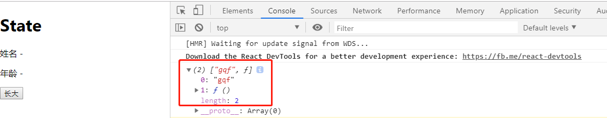

# useState

> 练习
* 使用类组件完成个简单的功能
    1. 在搭建实战项目前，先来学习下Hook的相关知识，本章先来搞下useState
    2. 使用脚手架工具，新建一个hook-demo，使用`create-react-app hook-demo`
    3. 创建好项目后，我们先用最原始的类式组件，创建一个State的组件，主要完成以下功能
        1. 展示姓名 年龄
        2. 有一个button按钮，点击后能让年龄自增1
    4. 在src下新建一个文件夹取名为**hooks**,新建**State.js**,然后编写该类式组件，具体代码如下
        ```js
        import React, {Component} from 'react'

        class State extends Component{
            constructor(props){
                super(props);
                this.state = {
                    name: "gqf",
                    age: 27
                }
            }
            render(){
                let {name, age} = this.state
                return (
                    <div>
                        <h1>State</h1>
                        <p>姓名 - {name}</p>
                        <p>年龄 - {age}</p>
                        <p><button onClick={() => {
                            this.setState({
                                age: ++age
                            })
                        }}>长大</button></p>
                    </div>
                )
            }
        }

        export default State;    
        ```
    5. 然后在App.js中使用该组件，具体代码如下
        ```js
        import React from 'react';

        import State from './hooks/State'

        function App() {
        return (
            <div className="App">
            <State/>
            </div>
        );
        }

        export default App;
        ```    
    6. 然后我们在页面上点击测试下，一直点击一直爽，我的年龄就飞一般的增长，如下图所示

        

* 使用Hooks实现相同的功能        
    1. 接下来我们就用Hooks来改写下
    2. 我们把之前class这段注释掉，然后在import中记得解构useState,具体代码是`import React, {Component, useState} from 'react'` 
    3. 首先我们先来看下useState这个怎么使用，并且在控制台能打印什么
        ```js
        function State(){
            console.log(useState("gqf"));
            return (
                <div>
                    <h1>State</h1>
                    <p>姓名 - </p>
                    <p>年龄 - </p>
                    <p><button>长大</button></p>
                </div>
            )
        }
        ```

         

    4. 从上述可以看出，useState返回的是一个数组，第一个参数其实就是初始值，第二个参数是个修改值的方法
    5. 所以我们接下来这么修改代码,就能完成和上面一样的功能了
        ```js
        function State(){
            const [name, setName] = useState("gqf");
            const [age, setAge] = useState(27) 
            return (
                <div>
                    <h1>State</h1>
                    <p>姓名 - {name}</p>
                    <p>年龄 - {age}</p>
                    <p><button onClick={() => {
                        setAge(age + 1);
                    }}>长大</button></p>
                </div>
            )
        }
        ```
    6. 这里有个东西是要说下，hooks推荐单一逻辑，所以上述代码的写法不建议改写成`useState({name: 'gqf', age: 27})`，
        并且在第二个参数,修改函数的实现上，与之前的setState不太一样，原先类式组件setState底层会使用合并参数的方式，而Hooks并不会合并，会造成一些问题(当然可以使用解构来解决),不推荐的写法如下
        ```js
        function State(){
            const [state, setState] = useState({
                name: "gqf",
                age: 27
            });
            let {name, age} = state;
            return (
                <div>
                    <h1>State</h1>
                    <p>姓名 - {name}</p>
                    <p>年龄 - {age}</p>
                    <p><button onClick={() => {
                        setState({
                            ...state,
                            age: ++age
                        })
                    }}>长大</button></p>
                </div>
            )
        }        
        ```
    7. 上述的代码依然能实现效果，需要注意的是，如果setState的时候没有解构state,我们的名字就变成空的了，因为hooks与原先的setState不一样，并不会合并参数，所以还是不建议这么写，记住**hooks推荐单一逻辑**，下图贴出没有解构state会出现的问题 

        

> 目录

* [返回目录](../../README.md)
* [上一节-ReactHooks搭建移动端实战项目](../day-01/ReactHooks搭建移动端实战项目.md)       
* [下一节-useEffect-1](../day-03/useEffect-1.md)       

