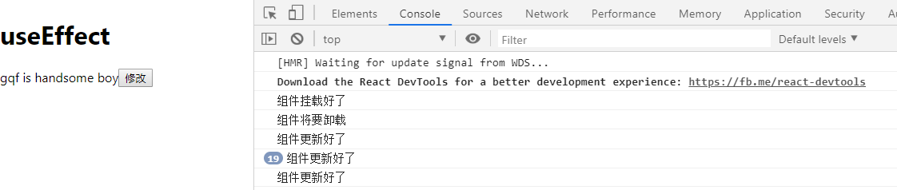

# useEffect-1

> 练习
1. 本节我们要使用hook中的useEffect,来看下生命周期怎么玩
2. 老样子，先用类式组件完成这样一个小功能
    * p标签下有一个展示文字的span标签，以及一个button按钮，
    * 点击button按钮，p标签隐藏，表单input框出现
    * input框修改内容后，失去焦点，input框隐藏，p标签显示修改后的文字内容
    * 这边主要还要玩下以下3个生命周期`componentDidMount`,`componentDidUpdate`,`componentWillUnmount`
    * 因为要演示组件卸载，我们可以把p标签这块逻辑(就是要点击编辑)单独拉出来做个组件
    * 这边的案例涉及到父子组件之间的通讯，所以需要一定的基础
    * 具体代码如下   
        ```js
        import React, {Component} from 'react'

        class Txt extends Component{

            componentWillUnmount(){
                console.log("组件将要卸载")
            }

            render(){
                let {msg, setEdit} = this.props;
                return (
                    <p>
                        <span>{msg}</span>
                        <button onClick={() => {
                            setEdit(true)
                        }}>修改</button>
                    </p>
                )
            }
        }

        class Effect extends Component{
            constructor(props){
                super(props)
                this.state = {
                    msg: "这个是测试用的msg",
                    edit: false,
                }
                this.setEdit = this.setEdit.bind(this);
            }

            componentDidMount(){
                console.log("组件挂载好了")
            }

            componentDidUpdate(){
                console.log("组件更新好了")
            }

            setEdit(val){
                this.setState({
                    edit: val
                })
            }

            render(){
                let {msg, edit} = this.state
                return (
                    <div>
                        <h1>useEffect</h1>
                        {   
                            !edit ? 
                            (
                                <Txt msg={msg} setEdit={this.setEdit}/>
                            )
                            :
                            (
                                <input 
                                    type="text" 
                                    value={msg} 
                                    onChange={e => {
                                        this.setState({
                                            msg: e.target.value
                                        })
                                    }} 
                                    onBlur={()=>{
                                        this.setEdit(false)
                                    }}
                                />
                            )
                        } 
                    </div>
                )
            }
        }

        export default Effect;        
        ``` 
    * 然后愉快的玩耍后就可以看到控制台打印了

            

3. 接下来我们就要改写了，玩下hook
    * 可以用这个案例温顾下上一节学习的useState
    * `useEffect` Hook 可以看做是 `componentDidMount`，`componentDidUpdate` 和 `componentWillUnmount` 这三个函数的组合。
    * show u the code
        ```js
        //函数式组件，传入的参数就是props，这里直接解构了
        function Txt({msg, setEdit}){
            useEffect(() => {
                return () => {
                    console.log("组件要卸载了")
                }
            })
            return (
                <p>
                    <span>{msg}</span>
                    <button onClick={() => {
                        setEdit(true)
                    }}>修改</button>
                </p>        
            )
        }

        function Effect(){
            //上一节学习的useState hook
            const [edit, setEdit] = useState(false);
            const [msg, setMsg] = useState("这个是测试用的msg");
            useEffect(() => {
                console.log("状态有改变");
            })
            return (
                <div>
                    <h1>useEffect</h1>
                    {   
                        !edit ? 
                        (
                            <Txt msg={msg} setEdit={setEdit}/>
                        )
                        :
                        (
                            <input 
                                type="text" 
                                value={msg} 
                                onChange={e => {
                                    setMsg(e.target.value)
                                }} 
                                onBlur={()=>{
                                    setEdit(false)
                                }}
                            />
                        )
                    } 
                </div>
            )
        }        
        ```
    * 我们会发现，的确在加载更新的时候会执行useEffect中的回调函数，卸载的话执行的是useEffect回调函数里return的函数 
    * [下一节](../day-04/useEffect-2.md)我们会继续看下useEffect的一些细节，比如我只想在加载的时候执行该怎么做等等   

> 目录

* [返回目录](../../README.md)
* [上一节-useState](../day-02/useState.md)      
* [下一节-useEffect-2](../day-04/useEffect-2.md)      