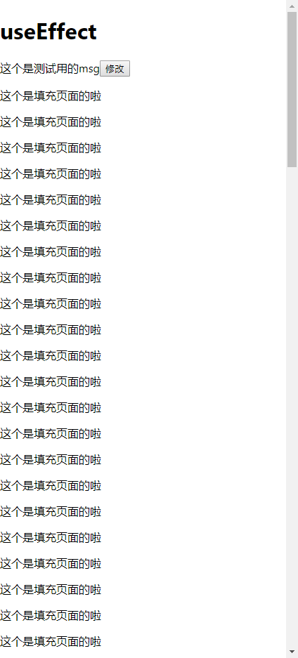

# useEffect-2

> 练习

1. 上一节我们简单使用了生命周期的hook，这一节我们在做下细节的补充
2. 在补充前，我们在把编辑的功能封装成个组件，代码如下
    ```js
    function Txt({msg, setEdit}){
        return (
            <p>
                <span>{msg}</span>
                <button onClick={() => {
                    setEdit(true)
                }}>修改</button>
            </p>        
        )
    }

    function Edit({msg, setMsg, setEdit}){
        return (
            <input 
                type="text" 
                value={msg} 
                onChange={e => {
                    setMsg(e.target.value)
                }} 
                onBlur={()=>{
                    setEdit(false)
                }}
            />
        )
    }

    function Effect(){
        const [edit, setEdit] = useState(false);
        const [msg, setMsg] = useState("这个是测试用的msg");
        return (
            <div>
                <h1>useEffect</h1>
                {   
                    !edit ? 
                    (
                        <Txt msg={msg} setEdit={setEdit}/>
                    )
                    :
                    (
                        <Edit msg={msg} setMsg={setMsg} setEdit={setEdit}/>                    
                    )
                } 
            </div>
        )
    }    
    ```
3. 为了要演示生命周期函数的一些细节，我们做以下的功能
    1. 先把页面撑大，让其拥有y方向的滚动条
    2. 在滚动的时候，让编辑框Edit组件吸顶
    3. Txt组件文本内容就不需要吸顶作用了

4. 所以我们先在Effect组件中，先填充内容，代码如下
    ```js
    function Effect(){
        const [edit, setEdit] = useState(false);
        const [msg, setMsg] = useState("这个是测试用的msg");
        return (
            <div>
                <h1>useEffect</h1>
                {   
                    !edit ? 
                    (
                        <Txt msg={msg} setEdit={setEdit}/>
                    )
                    :
                    (
                        <Edit msg={msg} setMsg={setMsg} setEdit={setEdit}/>                    
                    )
                } 
                {[...".".repeat(100)].map((item,index) => <p key={index}>这个是填充页面的啦</p>)}
            </div>
        )
    }
    ```
5. 然后就能看到如下图所示  

    

6. 接下来就要来玩生命周期了，**以下是本节学习的重点**
    1. 先来预习下，之前演示了useEffect，回调函数会监听挂载和数据更新，在回调函数中return函数可以监听组件挂载
    2. useEffect传入的第一个参数是回调函数，第二个参数可以传入一个数组
        1. 第二个参数什么都不传，就是上一节演示的，既可以监听挂载，也可以监听数据更新
        2. 数组里的元素怎么传，还记得之前用个useState的然后解构数组，第一个参数代表的是字段，第二个参数代表是设置字段值的函数，这个其实就可以配合useEffect传入的第二个参数，以下是举例说明
            * 先看下相关的代码
                ```js
                const [edit, setEdit] = useState(false);
                const [msg, setMsg] = useState("这个是测试用的msg");
                useEffect(() => {
                    console.log("发生改变了");
                }, [edit, msg])                
                ```
            * 传入的数组是`[edit, msg]`就说明监听edit和msg的变化，即生命周期`componentDidUpdate`   
            * 传入的数组是`[edit]`就说明只监听edit  
            * 传入的数组是`[msg]`就说明只监听msg
            * 传入的数组是`[]`就说明就在挂载的时候调用一次，即生命周期`componentDidMount`  
    3. 至于卸载怎么弄，重要的事在说一遍，就是在useEffect回调函数里return一个函数，这个函数就会在组件卸载的时候执行，即生命周期`componentWillUnmount` 

7. 接下来我们就来实现下功能吧
    1. 因为是让编辑框吸顶，所以我们在Edit组件中给第一次挂载的时候，给window添加scroll事件
    2. 其实就让input框通过transform改变值，一直吸在顶部 
        ```js
        function scrollFn(){
            // console.log(window.scrollY);
            let y = window.scrollY;
            let inputEle = document.getElementById("inputEle");
            // console.log(inputEle, y);
            inputEle.style.transform = `translateY(${y}px)`;
        }

        function Edit({msg, setMsg, setEdit}){
            useEffect(() => {
                // console.log("挂载的时候搞事情");
                window.addEventListener("scroll", scrollFn);
            }, [])
            return (
                <input 
                    id="inputEle"
                    type="text" 
                    value={msg} 
                    onChange={e => {
                        setMsg(e.target.value)
                    }} 
                    onBlur={()=>{
                        setEdit(false)
                    }}
                />
            )
        }        
        ``` 
    3. 然后需要注意一个细节，这边如果让编辑框失去焦点，那组件就会卸载，此时在滚动滚动条会报错，其实原因很简单，因为我们滚动的方法里需要获取input元素，由于组件被卸载了，input元素就找不到了，所以就报错了，这里的处理可以通过卸载的时候把window的滚动事件remove掉
        ```js
        function Edit({msg, setMsg, setEdit}){
            useEffect(() => {
                // console.log("挂载的时候搞事情");
                window.addEventListener("scroll", scrollFn);
                return () => {
                    window.removeEventListener("scroll", scrollFn);
                }
            }, [])
            return (
                <input 
                    id="inputEle"
                    type="text" 
                    value={msg} 
                    onChange={e => {
                        setMsg(e.target.value)
                    }} 
                    onBlur={()=>{
                        setEdit(false)
                    }}
                />
            )
        }        
        ```
    4. 这样这个功能就完成了，这边晒下图    

        

> 目录

* [返回目录](../../README.md)
* [上一节-useEffect-1](../day-03/useEffect-1.md)          
