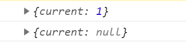
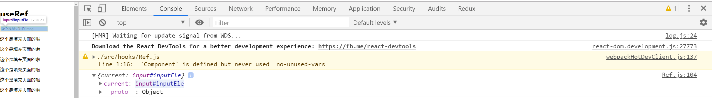

# useRef-1

> 练习

1. 对于ref大家肯定熟悉，在没有使用hook前，我们类式组件就玩过ref属性，用来获取元素
2. 接下来我们就来玩下useRef,我们拷贝一份Effect组件，改名为Ref 
3. 之前我们通过id的方式获取input框实在太low，使用useRef之前别忘记先在一开始的import里解构`import React, {Component, useState, useEffect, useRef} from 'react'`
4. 然后我们在Edit组件使用下，这里有个初始值，可以简单打印下给大家看下
    ```js
    let elTest1 = useRef(1);
    let elTest2 = useRef(null);
    console.log(elTest1);
    console.log(elTest2);    
    ```

    

5. 然后其实我们一般是给个初始值null,具体怎么用，在后面input元素上加上ref属性即可，代码如下
    ```js
    function Edit({msg, setMsg, setEdit}){
        // let elTest1 = useRef(1);
        // let elTest2 = useRef(null);
        // console.log(elTest1);
        // console.log(elTest2);
        let el = useRef(null); //初始化
        useEffect(() => {
            console.log(el);
            // console.log("挂载的时候搞事情");
            window.addEventListener("scroll", scrollFn);
            return () => {
                // console.log("卸载的时候搞事情")
                window.removeEventListener("scroll", scrollFn);
            }
        }, [])
        return (
            <input 
                id="inputEle" //这里先用low的方式，后面会讲到ref
                type="text"
                ref={el} //绑定
                value={msg} 
                onChange={e => {
                    setMsg(e.target.value)
                }} 
                onBlur={()=>{
                    setEdit(false)
                }}
            />
        )
    }    
    ```   

    

6. 我们接着完善我们的代码   
    ```js
    function Edit({msg, setMsg, setEdit}){
        let el = useRef(null);
        useEffect(() => {
            function scrollFn(){
                let y = window.scrollY;
                el.current.style.transform = `translateY(${y}px)`; //这行代码改动了使用了el.current
            }
            el.current.select(); //优化，加载的时候选中
            window.addEventListener("scroll", scrollFn);
            return () => {
                window.removeEventListener("scroll", scrollFn);
            }
        }, [])
        return (
            <input 
                type="text"
                ref={el} 
                value={msg} 
                onChange={e => {
                    setMsg(e.target.value)
                }} 
                onBlur={()=>{
                    setEdit(false)
                }}
            />
        )
    }    
    ```


> 目录

* [返回目录](../../README.md)
* [上一节-useEffect-2](../day-04/useEffect-2.md)