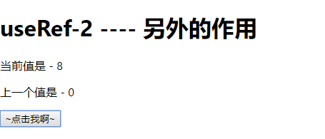
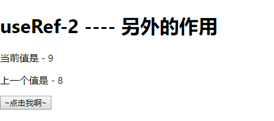

# useRef-2

> 练习

1. 上一节我们已经简单使用了useRef，并且优化了功能
2. 这一节会做一个简单的例子，来体现下useRef另外个作用
3. 我们把Ref组件注释掉新写个Ref组件，具体如下
    ```js
    function Ref(){
        let [number, setNumber] = useState(0);
        let prev = useRef(number);
        return (
            <div>
                <h1>useRef-2 ---- 另外的作用</h1>
                <p>当前值是 - {number}</p>
                <p>上一个值是 - {prev.current}</p>
                <button onClick={() => {
                    setNumber(number + 1)
                }}>~点击我啊~</button>
            </div>
        )
    }    
    ```
4. 操作一把我们能看到当前值是一直可以变化的，那上一个值该如何操作呢  

    

5. 其实很简单，我们这里要使用下useEffect,只要number更新了，我们去修改prev的值就可以了  
    ```js
    useEffect(() => {
        prev.current = number;
    })    
    ```
6. 然后在操作下就能看到效果啦~   

    

> 目录

* [返回目录](../../README.md)
* [上一节-useRef-1](../day-05/useRef-1.md)