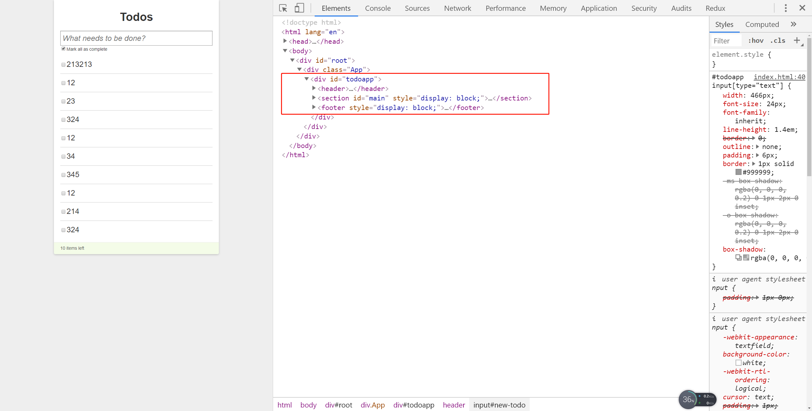
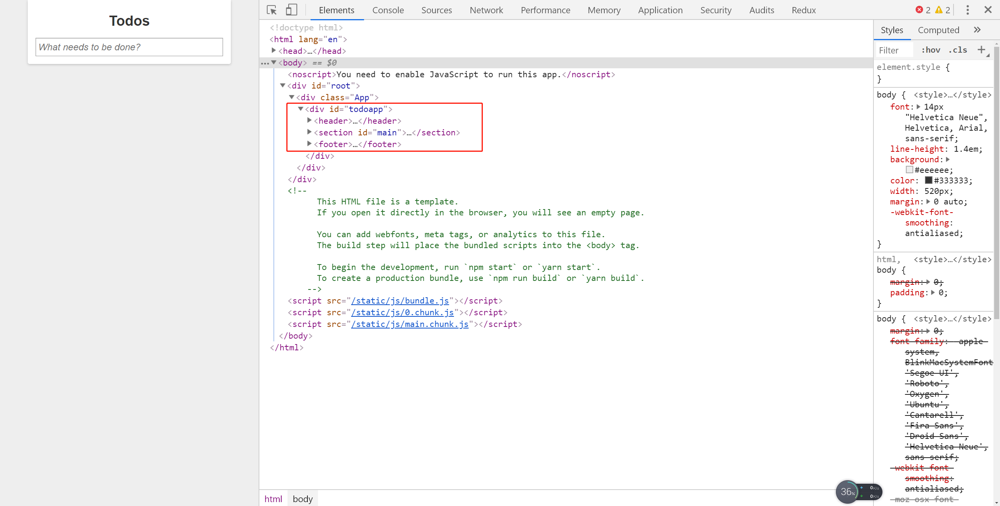

# todoList

> 实现效果

* 静态文件已放在最外层，与README同级
* 主要有以下几个功能
    1. 表单输入后按回车添加列表
    2. 选中可以编辑
    3. 选中可以删除
    4. 全选删除所有

> 练习

* 在src下新建个文件夹取名为**todos**
* 在src下新建index.js， index.css(css样式copy静态文件index.html中的style标签中的样式)，以及图片destory.png
* 参考静态页面，看到最为层的div，id属性为todoapp，先简单渲染下
    ```js
    import React from 'react'

    import './index.css'

    export default () => {
        return (
            <div id="todoapp">
                test
            </div>
        )
    }    
    ```
* 然后在App.js中引入这个组件，看下页面的效果 

    

* 我们在来观察下我们的静态文件，发现里面的子元素还有header，section，footer

    

* 所以这边我们在新建3个组件，分别取名为**Header**，**Main**，**Footer**

* Header组件的copy
    1. 新建一个header.js
    2. copy控制台element中header所有的HTML代码
        ```js
        import React from 'react'

        export default () => {
            return (
                <header>
                    <h1>Todos</h1>
                    <input id="new-todo" type="text" placeholder="What needs to be done?" value="" />
                </header>
            )
        }               
        ```
    3. 注意JSX的语法，input标签需要闭合    
    4. 在todos中的index.js引入Header组件，然后展示出来
        ```js
        import React from 'react'

        import './index.css'

        import Header from './header'

        export default () => {
            return (
                <div id="todoapp">
                    <Header />
                </div>
            )
        }        
        ```  
    5. 然后就能看到页面呈现这样的效果  

           

* Main组件的copy
    1. 先新建个main.js, 像之前一样复制下html的代码
    2. 这边可以先指保留一个li，并且处理下页面中的报错
        * 可以暂时先将style属性删除  
        * input标签记得闭合  
        * class改成className
        * label的for改成htmlFor  
        * 还有的报错是受控组件的问题，最后我们在处理
    3. 这里我们把li也封装成一个组件吧，偷懒下，就直接写在main.js中，新写个函数Li，然后把前面li标签内容return出去，并且在ul中引用
    4. 最终的代码是这样的
        ```js
        import React from 'react'

        function Li(){
            return (
                <li className="">
                    <div className="view" >
                        <input className="toggle" type="checkbox" />
                        <label>324</label>
                        <a className="destroy"></a>
                    </div>
                    <input className="edit" type="text" value="324" />
                </li>        
            )
        }

        export default () => {
            return (
                <section id="main" >
                    <input id="toggle-all" type="checkbox" checked="" />
                    <label htmlFor="toggle-all">Mark all as complete</label>
                    <ul id="todo-list">
                        <Li />
                    </ul>
                </section>
            )
        }        
        ``` 
* Footer组件的copy
    1. 新建个footer.js，依然老样子复制控制台静态文件的html代码 
    2. 老样子做些处理，比如把style属性先删了
    3. 代码如下所示
        ```js
        import React from 'react'

        export default () => {
            return (
                <footer>
                    <a id="clear-completed">Clear 0 completed item</a>
                    <div id="todo-count">10 items left</div>
                </footer>
            )
        }        
        ```  
* 最终在index.js中的js代码如下
    ```js
    import React from 'react'

    import './index.css'

    import Header from './header'
    import Main from './main'
    import Footer from './footer'

    export default () => {
        return (
            <div id="todoapp">
                <Header />
                <Main />
                <Footer />
            </div>
        )
    }    
    ``` 

* 最后在来看下控制台看下Element，看下html结构是否正确  

    


> 目录

* [返回目录](../../README.md)
* [上一节-useRef-2](../day-06/useRef-2.md)
* [下一节-添加todo](../day-08/添加todo.md)