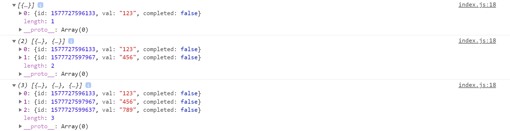

# 添加todo

> 练习

1. 上一节中已经简单布局好了页面结构，这一节简单的完成下添加todo的功能
2. 首先先来到index.js，记得解构一个useState，具体代码是`import React, {useState} from 'react'`
3. 然后使用useState，初始化todos，给个默认值，是个空数组，代表之后的列表，具体代码是`const [todos, setTodos] = useState([]);`
4. 接下来写个添加函数，这个函数需要传入Header组件
    ```js
    import React, {useState} from 'react'

    import './index.css'

    import Header from './header'
    import Main from './main'
    import Footer from './footer'

    export default () => {
        const [todos, setTodos] = useState([]);
        function addTodo(val){
            setTodos([...todos, {
                id: Date.now(),
                val,
                completed: false,
            }])
        }
        console.log(todos);
        return (
            <div id="todoapp">
                <Header addTodo={addTodo}/>
                <Main />
                <Footer />
            </div>
        )
    }    
    ```
5. 接下来就去处理下header组件，众所周知，受控组件不处理下是输入不了内容的，同样需要使用useState，还需要给input添加onChange事件，最后就是给input添加键盘按键事件
    ```js
    import React, {useState} from 'react'

    export default ({addTodo}) => {
        const [todo, setTodo] = useState("");
        return (
            <header>
                <h1>Todos</h1>
                <input 
                    id="new-todo" 
                    type="text" 
                    placeholder="What needs to be done?" 
                    value={todo} 
                    onChange={(e) => {
                        setTodo(e.target.value)
                    }}
                    onKeyDown={(e) => {
                        if(e.keyCode === 13){
                            if(!todo.trim().length){
                                alert("输入点内容");
                                e.target.focus();
                                return;
                            }else{
                                addTodo(todo);
                                setTodo("")
                            }
                        }
                    }}
                />
            </header>
        )
    }    
    ```
6. 然后就可以好好玩耍，测试一把看下结果
    1. 输入123按下回车    
    2. 输入456按下回车    
    3. 输入789按下回车  
    4. 看下控制台结果

          

> 目录

* [返回目录](../../README.md)
* [上一节-todoList](../day-07/todoList.md)
* [下一节-列表渲染](../day-09/列表渲染.md)