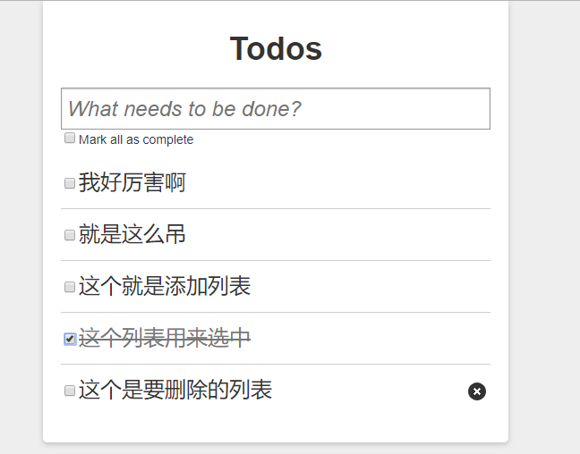

# 列表渲染

> 练习
1. 接着我们来完成列表渲染,在index.js把todos传入Main组件`<Main todos={todos}/>`，然后在Main组件解构下
2. section元素通过todos的长度来判断显示或隐藏`style={{display: todos.length ? "block" : "none"}}`
3. 展示Li组件，通过todos的map遍历，记得key属性要设置item的id，然后继续把item传入
    ```js
    <ul id="todo-list">
        {todos.map(item => {
            return <Li 
                        key = {item.id}
                        inner = {item}
                    />
        })}
    </ul>    
    ```
4. 接着继续处理Li组件
    1. 处理下li的className, 当对象的属性completed为true的时候复制done,`className={inner.completed ? "done" : ""}`
    2. checkbox先给checked设置`checked={inner.completed}`,受控组件onChange的事件等等在处理
    3. 渲染label，`<label>{inner.val}</label>`   
    4. a标签删除的事件等等在处理
    5. input修改的功能，也先给value设置下
        ```js
        <input className="edit" 
            type="text" 
            value={inner.val} 
        />        
        ```
    6. 接着在index.js处理下checked选中事件及删除事件，我们定义2个方法
        ```js
        function changeCompleted(id, completed){
            todos.forEach(item => {
                if(item.id == id){
                    item.completed = completed;
                }
            })
            setTodos([...todos]);
        }
        function deleteTodo(id){
            setTodos(todos.filter(item => item.id != id))
        }        
        ```  
    7. 记得传入Main组件`<Main todos={todos} changeCompleted={changeCompleted} deleteTodo={deleteTodo}/>` ,同样需要解构，然后传入Li组件 
    8. 最后Li在做处理
        ```js
        function Li({inner, changeCompleted, deleteTodo}){
            return (
                <li className={inner.completed ? "done" : ""}>
                    <div className="view" >
                        <input 
                            className="toggle" 
                            type="checkbox" 
                            checked={inner.completed}
                            onChange={(e) => {
                                changeCompleted(inner.id, e.target.checked)
                            }}
                        />
                        <label>{inner.val}</label>
                        <a className="destroy" onClick={()=>{
                            deleteTodo(inner.id)
                        }}></a>
                    </div>
                    <input className="edit"
                        type="text" 
                        value={inner.val} 
                    />
                </li>        
            )
        }        
        ``` 
    9. 这样，在本节我们实现了，添加li渲染列表，可以复选，可以删除，来张截图纪念下，然后在下节继续完善功能

                   


> 目录

* [返回目录](../../README.md)
* [上一节-添加todo](../day-08/添加todo.md)
* [下一节-内容编辑](../day-10/内容编辑.md)