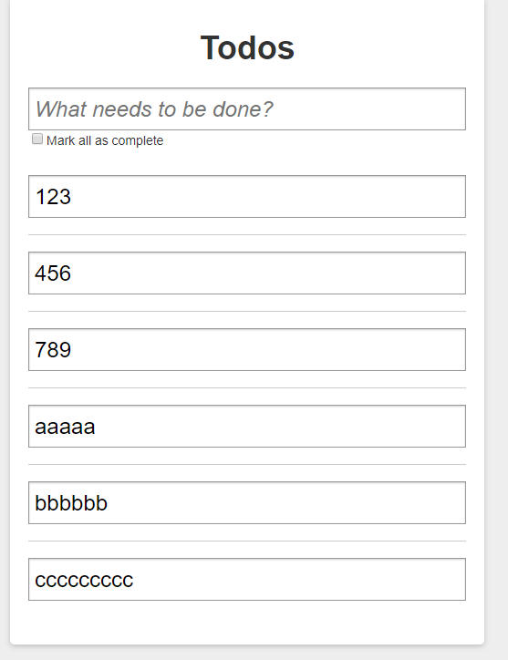

# 内容编辑

> 练习

1. 本节要完成内容编辑的功能，需要用到**useState**,**useEffect**,**useRef**,所以第一步`import React, {useState, useEffect, useRef} from 'react'`
2. Li组件使用useState设置edit初始值为false,然后控制div和input的显示，编辑框肯定在edit为true的时候显示，另外个div则相反
3. 在什么时候触发改变edit的值，双击label的时候edit改为true,编辑框失去焦点的时候改为false，2和3，实现的代码如下
    ```js
    function Li({inner, changeCompleted, deleteTodo}){
        const [edit, setEdit] = useState(false)
        return (
            <li className={inner.completed ? "done" : ""}>
                <div className="view" style={{display: edit? "none" : "block"}}>
                    <input 
                        className="toggle" 
                        type="checkbox" 
                        checked={inner.completed}
                        onChange={(e) => {
                            changeCompleted(inner.id, e.target.checked)
                        }}
                    />
                    <label onDoubleClick={() => {
                        setEdit(true);
                    }}>{inner.val}</label>
                    <a className="destroy" onClick={()=>{
                        deleteTodo(inner.id)
                    }}></a>
                </div>
                <input className="edit" 
                    type="text" 
                    value={inner.val} 
                    style={{display: edit? "block" : "none"}}
                    onBlur={() => {
                        setEdit(false);
                    }}
                />
            </li>        
        )
    }    
    ```
4. 因为要有焦点，然后失去焦点才会改变edit状态，所以会有这么个bug(双击后不聚焦，自然不会失去焦点，然后可以操作出一堆编辑框)，如下图所示 

    

5. 所以这边使用useEffect(监听edit状态)及useRef(获取edit的这个input元素)   
    ```js
    const editEl = useRef(null);
    useEffect(() => {

    }, [edit])    
    ```
6. 然后我们在编辑的input设置ref属性`ref={editEl}`
7. 完善useEffect功能,可以编辑的时候选中input框
    ```js
    useEffect(() => {
        if(edit){
            editEl.current.select();
        }
    }, [edit])    
    ```  
8. 接着实现编辑功能，大家懂得，其实还是在index.js中实现方法，然后父传子，最后Li这边input编辑框受控组件添加onChange事件
    1. 现在index.js实现编辑的函数 
        ```js
        function editVal(id, val){
            todos.forEach(item => {
                if(item.id == id){
                    item.val = val;
                }
            })
            setTodos([...todos]);
        }        
        ```  
    2. 父传子，解构，Li组件input编辑框添加onChange事件  
        ```js
        <input className="edit" 
            type="text" 
            value={inner.val} 
            style={{display: edit? "block" : "none"}}
            onBlur={() => {
                setEdit(false);
            }}
            ref={editEl}
            onChange={(e) => {
                editVal(inner.id, e.target.value)
            }}
        />        
        ``` 
    3. 这边还有个细节问题，如果编辑的内容为空的话，应该要处理下，我们在useEffect里做这样的处理  
        ```js
        useEffect(() => {
            if(edit){
                editEl.current.select();
            }else{
                if(!editEl.current.value.trim()){
                    setEdit(true)
                }
            }
        }, [edit])        
        ``` 
    4. 这样就算编辑框为空了也必须强制输入东西才能返回   
9. 经过本节的练习，基本一个todoList就完成了，还有最后点细节，我们在下一节继续          


> 目录

* [返回目录](../../README.md)
* [上一节-列表渲染](../day-09/列表渲染.md)
* [下一节-完善TodoList](../day-11/完善TodoList.md)