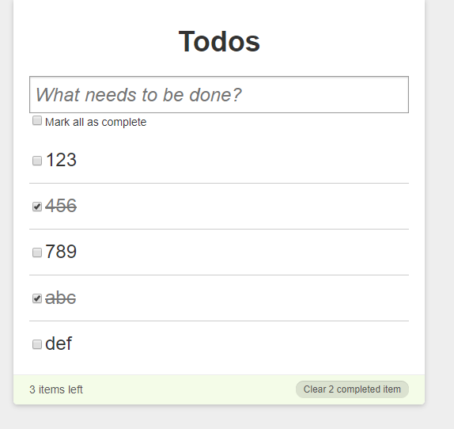
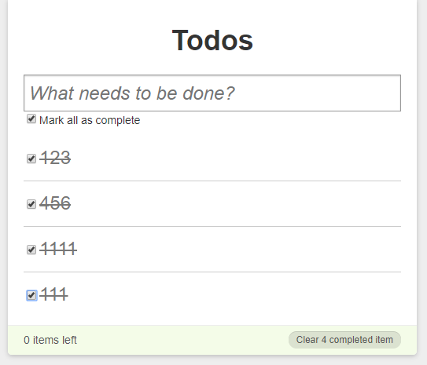

# 完善TodoList

> 完善的点

1. Footer展示完成数量
2. Footer展示未完成数量
3. Footer删除完成的
4. 全选，全不选功能

> 练习

1. 在index.js把todos传入Footer组件，Footer组件老样子解构
2. footer在todos的数量大于0的时候展示`style={{display: todos.length? "block" : "none"}}`
3. 通过过滤的方法，获取完成的todos和未完成的todos，然后渲染数量，并且控制样式，具体代码如下
    ```js
    import React from 'react'

    export default ({todos}) => {
        let completedTodos = todos.filter(item => item.completed);
        let unCompletedTodos = todos.filter(item => !item.completed);
        return (
            <footer style={{display: todos.length? "block" : "none"}}>
                <a  id="clear-completed" 
                    style={{display: completedTodos.length? "block" : "none"}}>
                        Clear {completedTodos.length} completed item
                </a>
                <div id="todo-count">{unCompletedTodos.length} items left</div>
            </footer>
        )
    }    
    ```
4. 此时页面已经有这样的效果了

    

5. 接下来做删除所有完成的功能，这个还是在index中写函数，然后传入Footer调用   
    ```js
    function removeCompleted(){
        setTodos(todos.filter(item => !item.completed))
    }
    ```
    ```js
    <Footer todos={todos} removeCompleted={removeCompleted}/>
    ```
    ```js
    <a  id="clear-completed" 
        style={{display: completedTodos.length? "block" : "none"}}
        onClick={() => {
            removeCompleted();
        }}
    >
        Clear {completedTodos.length} completed item
    </a>    
    ```

6. 现在还差个全选全不选功能没做，这个是在main.js中完成   
    1. 先做个最简单的操作，就是选中每项，全选的自动勾上，我们可以先获取已完成的todos,如果和todos长度一致，那就勾上全选的框
        ```js
        let completedTodos = todos.filter(item => item.completed);
        ```
        ```js
        checked={completedTodos.length === todos.length} 
        ```
    2. 此时我们可以选中每一项看下全选的那个框是否勾上 

        

    3. 接下来就是真做全选全不选的功能了，对，就是在index.js里写方法，传入Main，在Main里面的那个input的属性onChange调用
        ```js
        function changeAllCompleted(completed){
            todos.forEach(item => {item.completed = completed})
            setTodos([...todos]);
        }        
        ``` 
        ```js
        <Main 
            todos={todos} 
            changeCompleted={changeCompleted} 
            deleteTodo={deleteTodo} 
            editVal={editVal} 
            changeAllCompleted={changeAllCompleted}
        />        
        ```
        ```js
        <input 
            id="toggle-all" 
            type="checkbox" 
            checked={completedTodos.length === todos.length} 
            onChange={(e) => {
                changeAllCompleted(e.target.checked);
            }}
        />        
        ``` 

7. 这样一个完整的TodoList就完成了，小伙伴还要一起多练练哈

> 目录

* [返回目录](../../README.md)
* [上一节-内容编辑](../day-10/内容编辑.md)