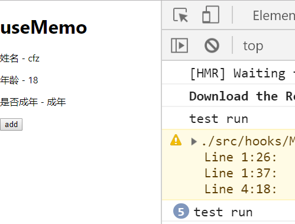
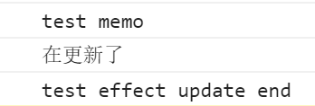

# useMemo

> 练习
1. 先在hooks文件夹下新建个Memo.js文件，基本的导出代码这边就不演示了，然后在App.js使用该组件
2. 然后实现一个点击按钮，年龄增加的功能，这个之前就做过个简单的demo，所以还是很轻松实现的，代码如下
    ```js
    import React, {useState, useEffect, useMemo} from 'react'

    export default () => {
        const [name, setName] = useState("cfz");
        const [age, setAge] = useState(3)
        return (
            <div>
                <h1>useMemo</h1>
                <p>姓名 - {name}</p>
                <p>年龄 - {age}</p>
                <button onClick={() => {
                    setAge(age + 3)
                }}>add</button>  
            </div>
        )
    }    
    ```
3. 接下来我们在做个功能，在渲染一个内容，就是年龄在18岁以上包括18岁，显示已成年，否则显示未成年  
    1. 我们定义个变量，然后自执行个函数，拿到结果
        ```js
        let isAdult = (() => {
            console.log("test run")
            return age < 18 ? "未成年" : "成年"
        })()        
        ```
    2. 然后这样渲染`<p>是否成年 - {isAdult}</p>`
    3. 页面玩耍后，效果的确实现了，一开始显示**未成年**，随着我们每次点击增加3岁，到18岁的时候页面正好显示为**成年**，如下图所示

         

    4. 但同时我们也看到了问题，就比如每次点击都会调用这个自执行的方法
5. useMemo就是优化这个情况的，他的使用方式和useEffect有点像，但不完全一样
    1. 写法如下
        ```js
        let isAdult = useMemo(() => {
            console.log("test memo")
            return age < 18 ? "未成年" : "成年"
        }, [age < 18])        
        ```
    2. 我们再在页面上点击看下效果，发现这个打印语句**use memo**只调用了一次
    3. 接下来我们来看下useEffect和这个调用时机的区别
        ```js
        let isAdult = useMemo(() => {
            console.log("test memo")
            return age < 18 ? "未成年" : "成年"
        }, [age < 18])
        useEffect(() => {
            console.log("test effect", "update end");
        }, [age])
        console.log("在更新了")        
        ```   
    4. 上述代码一共有3个打印语句，我们页面操作下看下情况 

          

    5. 上述图片说明，是先触发memo(有memo先触发memo)，然后渲染页面打印在更新了，然后最后再是生命周期函数阶段-更新已完成

> 目录

* [返回目录](../../README.md)
* [上一节-完善TodoList](../day-11/完善TodoList.md)              