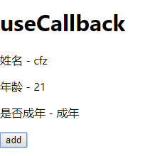

# useCallBack

> 练习
1. 我们复制下Memo文件, 取名为Callback.js
2. 我们先来对useMemo进行下改写
    ```js
    let isAdult = useMemo(() => {
        console.log("test memo")
        // return age < 18 ? "未成年" : "成年"
        return () => {return age < 18 ? "未成年" : "成年"}
    }, [age < 18])    
    ```
    ```js
    <p>是否成年 - {isAdult()}</p>
    ```
3. 因为我们把返回值改成一个函数，所以在下面的isAdult是个函数需要执行才能拿到结果，然后就和我们之前的效果一模一样了
4. useCallback其实是useMemo的一个变种，所以我们可以这么改写   
    ```js
    let isAdult = useCallback(() => age < 18 ? "未成年" : "成年", [age < 18])    
    ```
5. 下面还是依然要调用所以还是`<p>是否成年 - {isAdult()}</p>`，然后页面的功能就用useCallback实现了  

    

> 目录

* [返回目录](../../README.md)
* [上一节-useMemo](../day-12/useMemo.md)
* [下一节-useContext-1](../day-14/useContext-1.md)