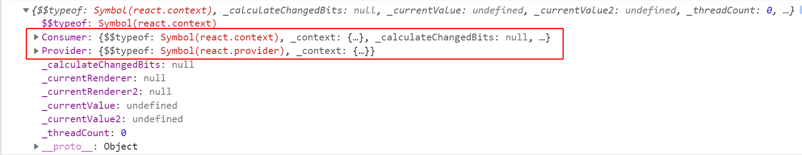
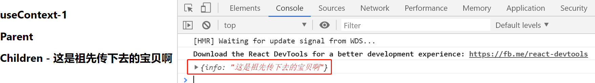
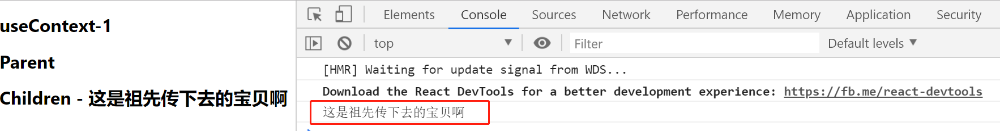

# useContext-1

> 练习
1. 在hooks目录下新建一个context.js，为了演示这次的createContext，我们先用类式组件演示, 一开始的import是这样的`import React, {Component, createContext} from 'react'`
2. 演示个子级拿祖父级的功能
    ```js
    import React, {Component, createContext} from 'react'

    class Children extends Component{
        render(){
            return (
                <div>
                    <h1>
                        Children - {this.props.info}
                    </h1>
                </div>
                
            )
        }
    }

    class Parent extends Component{
        render(){
            return (
                <div>
                    <h1>
                        Parent
                    </h1>
                    <Children info={this.props.info}/>
                </div>
            )
        }
    }

    export default class Context extends Component{
        render(){
            return (
                <div>
                    <h1>
                        useContext-1
                    </h1>
                    <Parent info={"这个是要传递的msg"}/>
                </div>
            )
        }
    }    
    ```
3. 通过这个例子，我们能看到Context组件先把值传给Parent组件，然后Parent又把值传给Children组件，一层一层往下传，所以Children组件拿到了祖级传的值
4. 试想，如果嵌套很深，这种传值方式就非常麻烦，所以这里`createContext`闪亮登场   
5. 我们先来打印下`createContext`,`console.log(createContext())`

    

6. 核心的就是**Provider**(传递值)和**Consumer**(接受值)，我们这里解构下`let {Provider, Consumer} = createContext();` 
7. 如何传值，就是在组件render函数返回的时候，在最外层包一层Provider，并且通过value属性传值
    ```js
    export default class Context extends Component{
        render(){
            return (
                <Provider value={{info: '这是祖先传下去的宝贝啊'}}>
                    <div>
                        <h1>
                            useContext-1
                        </h1>
                        <Parent />
                    </div>
                </Provider>
                
            )
        }
    }    
    ```  
8. 如何取值，就是需要接受值的那个组件，最外面包一层Consumer，然后使用个回调函数去接受这个值
    ```js
    class Children extends Component{
        render(){
            return (
                <Consumer>
                    {
                        (ctx) => {
                            console.log(ctx)
                            return (
                                <div>
                                    <h1>
                                        Children - {ctx.info}
                                    </h1>
                                </div>
                            )
                        }
                    }
                </Consumer>
            )
        }
    }    
    ```
9. 来看下完成的效果，注意这里的打印语句`console.log(ctx)`   

    

10. 接下来我们传个字符串在看下`value={'这是祖先传下去的宝贝啊'}`， 记得Children这里接受也要改下`Children - {ctx}`，此时在看下打印的ctx    

    

> 目录

* [返回目录](../../README.md)
* [上一节-useCallback](../day-13/useCallback.md)
* [下一节-useContext-2](../day-15/useContext-2.md)