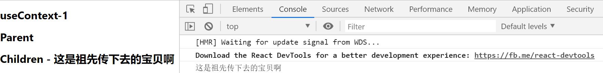
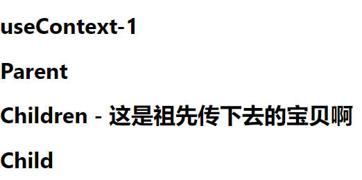
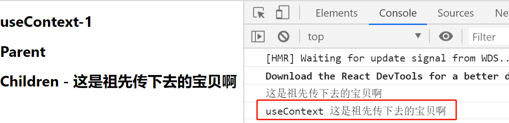

# useContext-2

> 练习
1. 之前我们用类式组件，玩了下createContext，在接受数据的时候，需要在回调函数里这样那样，其实有更方便的方式，接下来我们来看下
2. 其实就是在接受数据的时候不想使用Consumer，因为太麻烦了
3. 我们先复制一份Child组件，不使用Consumer，先这样写
    ```js
    class Children extends Component{
        render(){
            return (
                <div>
                    <h1>
                        Children
                    </h1>
                </div>
            )
        }
    }    
    ```
4. 前面解构createContext的方式也改变下，我们使用个变量
    1. 具体代码是这样的
        ```js
        // let {Provider, Consumer} = createContext();
        let myContext = createContext();        
        ```    
    2. 然后下面使用Provider的就要这么改
        ```js
        export default class Context extends Component{
            render(){
                return (
                    // <myContext.Provider value={{info: '这是祖先传下去的宝贝啊'}}>
                    <myContext.Provider value={'这是祖先传下去的宝贝啊'}>
                        <div>
                            <h1>
                                useContext-1
                            </h1>
                            <Parent />
                        </div>
                    </myContext.Provider>
                    
                )
            }
        }        
        ```  
5. 然后在前面的Child组件里给个静态属性contextType，就能取到我们传过来的值了
    ```js
    class Children extends Component{
        static contextType = myContext;
        render(){
            console.log(this.context)
            return (
                <div>
                    <h1>
                        Children - {this.context}
                    </h1>
                </div>
            )
        }
    }    
    ``` 

      

6. 现在我们在用函数组件来玩下，我们来写个Child，然后在Parent中使用这个Child组件
    ```js
    function Child(){
        return (
            <div>
                <h1>
                    Child
                </h1>
            </div>        
        )
    }        
    ```  
    ```js
    class Parent extends Component{
        render(){
            return (
                <div>
                    <h1>
                        Parent
                    </h1>
                    <Children/>
                    <Child/>
                </div>
            )
        }
    }    
    ``` 

     

7. 先来个原始的写法，就是用下myContext.Consumer，看下有没有问题，实验下来是没有任何问题的
    ```js
    function Child(){
        return (
            <myContext.Consumer>
                {
                    (ctx) => {
                        console.log(ctx)
                        return (
                            <div>
                                <h1>
                                    Child - {ctx}
                                </h1>
                            </div> 
                        )
                    }
                }
            </myContext.Consumer>
                
        )
    }    
    ```  
8. 接下来就是重头戏了，我们要使用传说中的useContext,记得在import中解构
9. 我们在复制一份Child，把之前的注释掉，先来打印下useContext，它需要接受个参数，就是前面createContext的时候用的myContext
    ```js
    function Child(){
        console.log("useContext",useContext(myContext))
        return (
            ""      
        )
    }    
    ```   

              

10. 所以最终代码就是这么写的，注意这里因为我们一开始祖先传的就是字符串，所以直接用info变量拿到字符串，如果是像一开始使用对象传的话，可以解构，类似这么写` let {info} = useContext(myContext);`
    ```js
    function Child(){
        // console.log("useContext",useContext(myContext))
        let info = useContext(myContext);
        return (
            <div>
                <h1>
                    Child - {info}
                </h1>
            </div>       
        )
    }    
    ```

11. 实际工作中，不推荐在对React数据流不熟悉的情况下，使用Context，真正用的时候其实用react-redux，redux其实也是基于context实现的，下一节会介绍useReducer，配合context实现个简易的redux    

> 目录

* [返回目录](../../README.md)
* [上一节-useContext-1](../day-14/useContext-1.md)