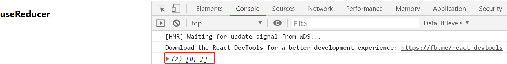
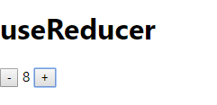

# useReducer

> 练习
1. 继续在hooks目录下新建个Reducer.js
2. 写个reducer函数，我们就写个简单点的加加减减的这种
    ```js
    function reducer(state = 0, action){
        switch(action.type){
            case "add":
                state += 1;
                break;
            case "minus":
                state -= 1;
                break;        
        }
        return state;
    }    
    ```
3. 然后我们在组件中，打印下
    ```js
    export default () => {
        console.log(useReducer(reducer, 0))
        return (
            <div>
                <h1>useReducer</h1>
            </div>
        )
    }    
    ```

       

4. 接下来我们就来做下这个加加减减的功能，先写下Child组件，然后在我们的Reducer中调用
    ```js
    function Child(){
        return (
            <div>
                <button>  -  </button>
                <span> 0 </span>
                <button>  +  </button>
            </div>
        )
    }    
    ```
5. 然后我们就要使用上一节所学的知识useContext  
    1. 先import解构，然后调用createContext
        ```js
        import React, {useReducer, createContext, useContext} from 'react'

        let myContext = createContext();        
        ```  
    2. 接着使用myContext.Provider包裹, 并且传值  
        ```js
        export default () => {
            // console.log(useReducer(reducer, 0))
            let [state, dispatch] = useReducer(reducer, 0);
            return (
                <myContext.Provider value={{state, dispatch}}>
                    <div>
                        <h1>useReducer</h1>
                        <Child/>
                    </div>
                </myContext.Provider>
            )
        }        
        ```
    3. 然后在Child组件里接收值 
        ```js
        function Child(){
            let {state, dispatch} = useContext(myContext)
            return (
                <div>
                    <button onClick={() => {
                        dispatch({
                            type: "minus"
                        })
                    }}>  -  </button>
                    <span> {state} </span>
                    <button onClick={() => {
                        dispatch({
                            type: "add"
                        })
                    }}>  +  </button>
                </div>
            )
        }        
        ``` 
6. 这样一个加加减减的功能就完成了                 

    

> 目录

* [返回目录](../../README.md)
* [上一节-useContext-2](../../Day01-15/day-15/useContext-2.md)