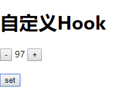

# 自定义hook

> 练习
1. 在hooks目录下新建Hook.js
2. 如何自定义Hook
    1. 首先自定义Hook可以使用其他的hook
    2. 自定义hook规范也需要use打头，比如这里依然演示下上一节的效果，所以我们这边自定义hook就取名为**useCount**
    3. 可以返回任何东西
    4. 下面就是我们演示的代码
        ```js
        function useCount(init){
            let [count, setCount] = useState(init);
            function add(){
                count++;
                setCount(count);
            }
            function minus(){
                count--
                setCount(count);
            }
            return [count, setCount, add, minus];
        }        
        ```
3. 接下来就来使用下我们前面自定义的Hook 
    ```js
    export default () => {
        let [count, setCount, add, minus] = useCount(0);
        return (
            <div>
                <h1>自定义Hook</h1>
                <div>
                    <button onClick={() => {
                        minus();
                    }}>  -  </button>
                    <span>  {count}  </span>
                    <button onClick={() => {
                        add();
                    }}>  +  </button>
                </div>
                <div style={{marginTop: '20px'}}>
                    <button onClick={() => {
                        setCount(Math.random() * 100 | 0)
                    }}>set</button>
                </div>
            </div>
        )
    }    
    ``` 
4. 以上代码就实现了个加加减减，并且set按钮点击后随即赋值个数字
    
    

5. 最后在来强调下hook的规则    
    * 只在最顶层使用Hook - 具体指的就是函数组件(方法)一开始的时候就要使用Hook
    * 只在React函数中调用Hook 
        * React函数组件中 - 这个是强调不能再class组件里使用Hook
        * React Hook中 - 可以在自定义Hook中使用Hook      

> 目录

* [返回目录](../../README.md)
* [上一节-useReducer](../day-16/useReducer.md)