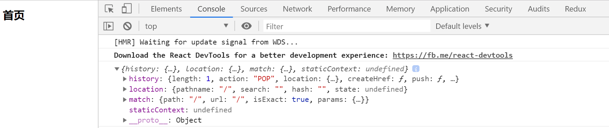
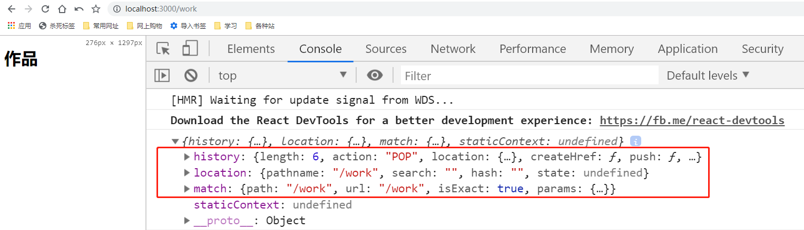

# 路由管理

> 视图讲解

1. 首页 - index
2. 登录 - login
3. 课程安排 - course
4. 讲师团队 - lectruer
5. 作品详情 - work

> 练习
1. src下新建view文件夹，在view文件夹下新建以下文件夹，后续需要其他视图会在补充
    1. 首页视图 - index文件夹下新建index.js
    2. 登录视图 - login文件夹下新建index.js
    3. 课程安排视图 - course文件夹下新建index.js
    4. 讲师团队视图 - lectruer文件夹下新建index.js
    5. 作品详情视图 - work文件夹下新建index.js

2. 路由index.js的模板如下，我们在h1标签里先随便写些文字，比如首页视图，就写`<h1>首页</h1>`
    ```js
    import React from 'react'

    export default () => {
        return (
            <div>
                <h1></h1>
            </div>
        )
    }    
    ```  
3. 在处理路由前，我们先在App.js里引入我们的`BrowserRouter`,具体代码如下
    ```js
    import React from 'react';
    import {BrowserRouter} from 'react-router-dom'

    function App() {
        return (
            <BrowserRouter>
                <div className="App">
                    
                </div>
            </BrowserRouter>
        );
    }

    export default App;
    ```    
4. 在src下在新建个router文件，专门管理我们的路由，里面有2个文件，一个是index.js(专门写我们的路由管理)，一个是route_list.js(用来存放路由信息)
5. 先来写下路由信息route_list.js，我们还可以调试下，比如在首页的页面组件里打印下props
    ```js
    import React from 'react'

    import Index from '../view/index/index'

    const routeList = [
        {
            name: "首页",
            path: "/",
            exact: true,
            render(props){
                return <Index {...props}/>
            }
        },
    ];

    export default routeList;    
    ```  
6. 接着来写下管理路由的index.js
    ```js
    import React from 'react'
    import {Switch, Route} from 'react-router-dom'

    import routeList from './route_list'

    export default () => {
        return (
            <Switch>
                {routeList.map((item, index) => {
                    return (
                        <Route
                            key={index} 
                            path={item.path} 
                            exact={item.exact} 
                            render={item.render}
                        />
                    )
                })}
            </Switch>
        )
    }    
    ``` 
7. 之后在App.js里引入这个**路由总管**~  
    ```js
    import React from 'react';
    import {BrowserRouter} from 'react-router-dom';
    import IndexRoute from './router/index'

    function App() {
        return (
            <BrowserRouter>
                <div className="App">
                    <IndexRoute />
                </div>
            </BrowserRouter>
        );
    }

    export default App;
    ``` 
8. 然后我们来看下页面呈现的效果 

    

9. 发现没有任何问题，接着我们在route_list.js配好其他的路由，在前端页面在玩下打印，这一节任务就完成了~  

    


> 目录

* [返回目录](../../README.md)
* [上一节-项目构建](../day-18/项目构建.md)