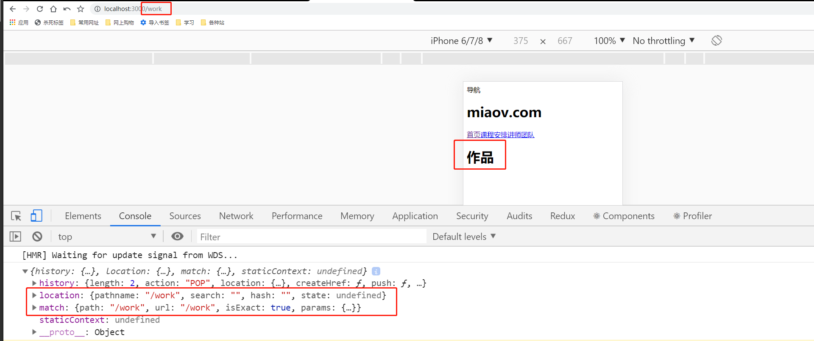

# 页面框架

> 准备

* 因为主要是react实战，这里就不演示布局的细节了，提早准备好了静态文件

* 打开静态文件的index.html可以看下效果

    

> 练习
1. src下新建common文件夹，里面在新建这几个文件夹
    * component
    * css
    * font
    * images

2. 先来写frame框架吧，在component里新建frame.js 
    ```js
    import React from 'react';

    export default function Frame(){
        return (
            <div>
                
            </div>
        )
    }    
    ```
3. 从前面的静态文件，其实可以看出，页面框架主要是header，menu，main，所以接下来，我们需要分别创建这几个组件
4. 在component下新建header.js，把之前的静态页面的header标签下的代码复制过来，记得处理下class改成className，然后在frame里引用Header组件
    ```js
    import React from 'react'

    export default function Header(){
        return (
            <header id="header">
                <nav className="menu">
                    <a>导航</a>
                </nav>
                <h1 className="logo">miaov.com</h1>
                <a className="user"></a>
            </header>
        )
    }       
    ```  
5. 同理我们在新建个menu.js，同样的操作同样的处理   
6. 然后main这边我们先就在frame里面写个div的标签，里面的内容后续会在填入各种组件 
    ```js
    import React from 'react';

    import Header from './header'
    import Menu from './menu'

    export default function Frame(props){
        console.log(props)
        return (
            <div>
                <Header/>
                <Menu/>
                <div id="main">

                </div>
            </div>
        )
    }    
    ```
7. 然后在App.js引入这个框架~，这个时候打开页面就可以看到没有css比较丑的样子，注意我们这里看下控制台，这边有我们之前打印的Frame的props
    ```js
    import React from "react";
    import { BrowserRouter } from "react-router-dom";
    import IndexRoute from "./router/index";
    import Frame from './common/component/frame'

    function App() {
    return (
        <BrowserRouter>
            <Frame>
                <IndexRoute />
            </Frame>
        </BrowserRouter> 
    );
    }

    export default App;

    ```    

    

8. 看到上面的打印消息后，我们可以在frame里追加代码`{props.children}`，此刻我们就能看到根据不同的路由，main里就渲染出东西了 

    

9. 接着就是化妆术了，我们把静态资源的css，font，images都拷贝到我们的项目中  
10. 然后先修改掉一些问题，然后在frame.js中引入reset，common
    * 修改font下的一个文件，改名为PingFang_Bold.ttf(文件名格式问题所以要修改)
    * 在reset.css中引入的时候改成`src: url("../font/PingFang_Bold.ttf");`(修改好要引入正确的文件名)
    * rem的问题，在reset.css里加入`html{font-size: 10vw}`(原先的静态页面通过js去修改font-size,这边我们就使用css的方式)
    * 找到common.css,设置下**main**的背景颜色`#f2f9fc`(没有背景颜色导致还能看到menu，所以设置个背景颜色)
        ```css
        #main {
            position: relative;
            z-index: 1;
            padding-top: 1.2rem;
            min-height: 12.82666667rem;
            background-color: #f2f9fc;
        }
        ```

11. 最后就来看下我们这一节学习后的最终效果是什么样子的~

    


> 目录

* [返回目录](../../README.md)
* [上一节-路由管理](../day-19/路由管理.md)