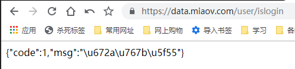
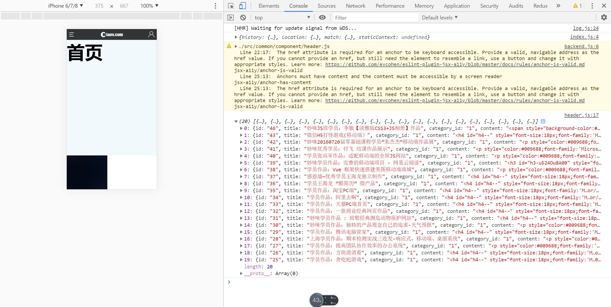

# 请求配置-1

> 准备
1. 本次项目主要以前端react实战为主，所以后端使用现成的接口
2. 在顶级目录下有个**接口说明.txt**，可以查看对应的接口
3. 我们可以在浏览器这边随便试一个，比如url输入`https://data.miaov.com/user/islogin`

    

4. 处理跨域问题，我们这边还要额外安装2个依赖
    * http-proxy-middleware
    * qs    

> 练习
1. 先在store下新建个文件夹action，在action中在新建http.js
    ```js
    import axios from 'axios'

    const http = axios.create({
        baseURL: "/miaov", //以miaov开始的就做代理转发
        
    })    
    ```
2. 然后我们在package.json里在配置proxy属性,先来演示下老版本的写法
    * secure - 配置(true)转发模式还是(false)直接把请求地址替换了
    * changeOrigin - 请求带的host信息 (false)后端host信息还是(true)浏览器host
    * pathRewrite - 写入替换
    ```json
    "proxy": {
        "/miaov": {
            "target": "https://data.miaov.com/",
            "secure": true, 
            "changeOrigin": true,
            "pathRewrite": {
                "^/miaov": ""
            }
        }
    },    
    ```
3. 在新版本的create-react-app中proxy是配置一个字符串，只需要配置`"proxy":"https://data.miaov.com/"`      
4. 所以现在这个该如何处理，就要用到我们准备工作中新装的依赖`http-proxy-middleware`和`qs`
5. 我们把前面package.json中配的proxy属性删了，采用全新写法，现在src目录下新建**setupProxy.js**
6. 其实配置项和之前老版本的配置方式差不多，还需要多加个cookieDomainRewrite的配置，具体代码如下
    ```js
    const proxy = require("http-proxy-middleware")

    module.exports = function(app){
        app.use("/miaov", proxy({
            "target": "https://data.miaov.com/",
            "secure": true, 
            "changeOrigin": true,
            "pathRewrite": {
                "^/miaov": ""
            },
            "cookieDomainRewrite": "https://data.miaov.com/" 
        }))
    }  
    ```
7. 在回到前面的http.js继续代码的书写，配置是否携带cookie，请求拦截器(拦截data,url请求可能是中文，所以要用qs，转成成编码状态)
    ```js
    import axios from 'axios'

    import qs from 'qs' 

    const http = axios.create({
        baseURL: "/miaov", //以miaov开始的就做代理转发
        withCredentials: true,
        transformRequest: (data) => {
            return qs.stringify(data)
        }
    })

    export default http;    
    ```

8. 然后我们就去header.js去试下我们写的http~ 
    ```js
    import React from 'react'

    import http from '../../store/action/http'

    export default function Header(){
        http.post(
            "/lecturer/lists?page=1&rows=20",
            {
                order: "desc",
                sort: "id",
                category_id: 1,
                recommend: 1
            }
        ).then((res) => {
            return res.data;
        }).then(data => {
            console.log(data);
        })
        return (
            <header id="header">
                <nav className="menu">
                    <a>导航</a>
                </nav>
                <h1 className="logo">miaov.com</h1>
                <a className="user"></a>
            </header>
        )
    }    
    ```

        

> 目录

* [返回目录](../../README.md)
* [上一节-页面框架](../day-20/页面框架.md)
* [下一节-请求配置-2](../day-22/请求配置-2.md)