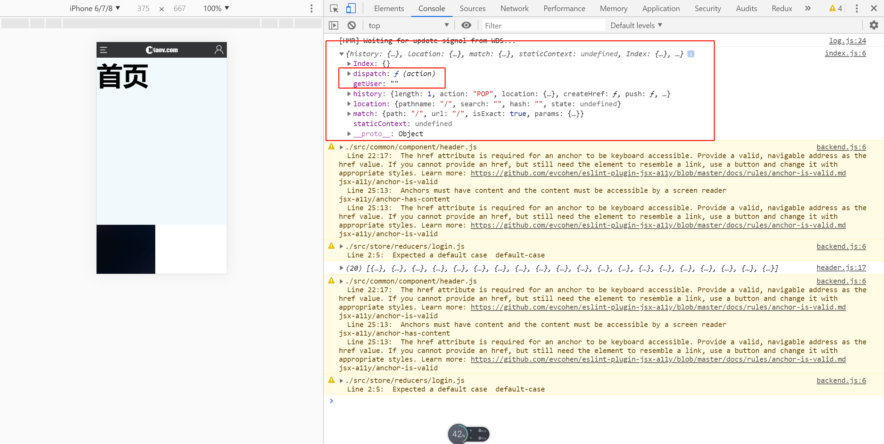
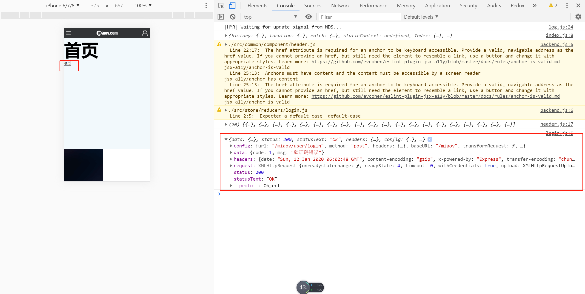

# 请求配置-2

> 练习
1. 先把之前reducers下的index.js和store下的index.js改写下
    ```js
    function Index(state = {}, action){
        return state;
    }

    export default {
        Index
    }    
    ```
    ```js
    import {createStore, applyMiddleware, combineReducers} from 'redux';
    import Thunk from 'redux-thunk'

    import reducers from './reducers/index';

    const store = createStore(
        combineReducers(reducers),
        applyMiddleware(Thunk)
    )

    export default store;    
    ```
2. 接着在reducers下新建个login.js，写以下代码
    ```js
    export default function getUser(state = "", action){
        switch(action.type){
            case "LOGIN":
                return action.user;
            case "LOGOUT":
                return "";    
        }
        return state;
    }   
    ```    
3. 在reducers的index.js引入
    ```js
    import getUser from './login'

    function Index(state = {}, action){
        return state;
    }

    export default {
        Index,
        getUser,
    }    
    ```  
4. 在action中新建login.js 
    ```js
    import HTTP from './http'
    export default function login(data){
        return function(dispatch){
            HTTP.post("/user/login").then(res => {
                console.log(res);
            })
        }
    }    
    ``` 
5. 然后找到我们的首页视图，使用react-redux中的connect，然后看下控制台打印的props
    ```js
    import React from 'react'

    import {connect} from 'react-redux'

    function Index(props){
        console.log(props)
        return (
            <div>
                <h1>首页</h1>
            </div>
        )
    }

    export default connect(res => {
        return res;    
    })(Index);    
    ```

    
           
6. 接着调用下异步中间件
    ```js
    import React from 'react'

    import {connect} from 'react-redux'

    import login from '../../store/action/login'

    function Index(props){
        console.log(props)
        return (
            <div>
                <h1>首页</h1>
                <button
                    onClick = {() => {
                        props.dispatch(login())
                    }}            
                >登录</button>
            </div>
        )
    }

    export default connect(res => {
        return res;    
    })(Index);    
    ```
7. 然后点击下登录就能看到效果了

    

> 目录

* [返回目录](../../README.md)
* [上一节-请求配置-1](../day-21/请求配置-1.md)
* [下一节-登录-1](../day-23/登录-1.md)