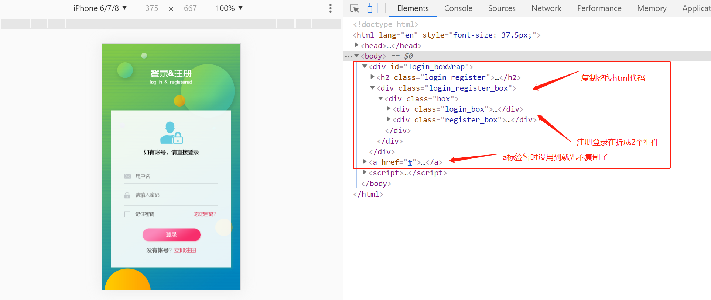
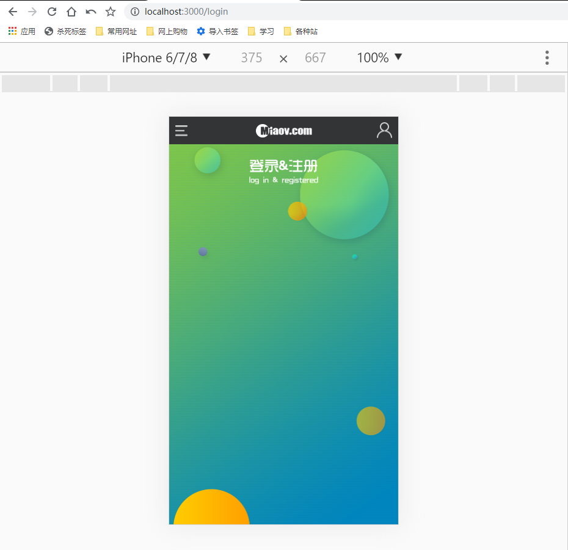
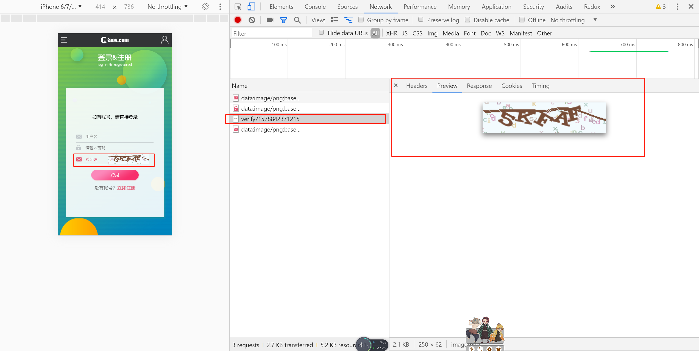
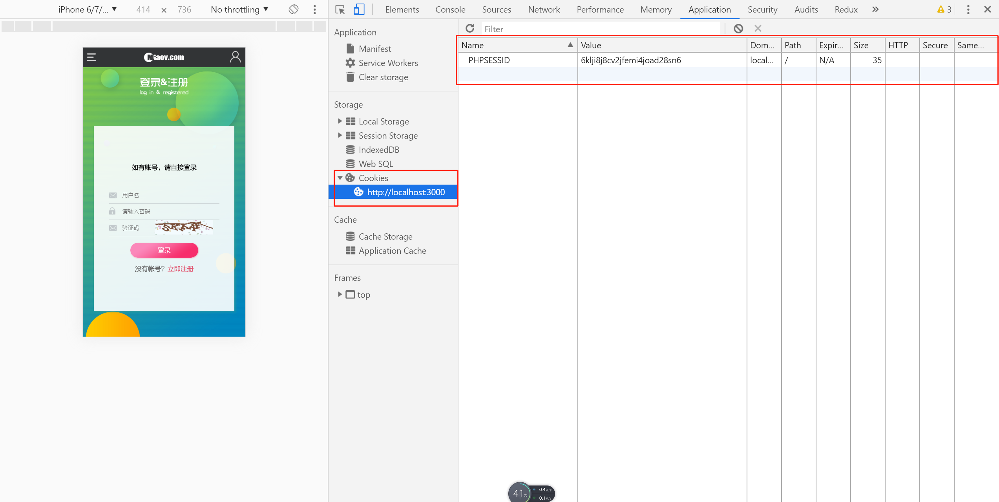

# 登录-1

> 练习
1. 先去头部的视图组件，点击右上角跳转登录的视图，这里要使用Link标签，然后把之前的a标签换成Link，并且加上to的属性
    ```js
    import React from 'react'

    import {Link} from 'react-router-dom'

    import http from '../../store/action/http'

    export default function Header(){
        http.post(
            "/lecturer/lists?page=1&rows=20",
            {
                order: "desc",
                sort: "id",
                category_id: 1,
                recommend: 1
            }
        ).then((res) => {
            return res.data;
        }).then(data => {
            console.log(data);
        })
        return (
            <header id="header">
                <nav className="menu">
                    <a>导航</a>
                </nav>
                <h1 className="logo">miaov.com</h1>
                <Link className="user" to="/login"/>
            </header>
        )
    }    
    ```
2. 接着就是去我们的视图组件login搞点事情，我们找下我们的静态文件，看下结构 

    

3. 然后就复制黏贴，记得把样式引入，还有className需要改下(之后复制的每一步就不提示了，包括一些input表单单标签需要加/)  
    ```js
    import React from 'react'

    import '../../common/css/login.css'

    export default () => {
        return (
            <div id="login_boxWrap">
                <h2 className="login_register"><span>登录&注册</span></h2>
                <div className="login_register_box">
                    <div className="box">
                        
                    </div>
                </div>
            </div>
        )
    }    
    ```

      

4. 接着先来做下登录的组件，在视图组件login文件夹下新建login.js，导出后记得在index中在引入下
 
5. 这里记住密码忘记密码的功能我们就不做了，添加一个验证码，由于样式什么不是本次实战的重点，页面的美化这边小伙伴们就自己随意搞下，我自己这边是做了以下几个处理
    * password和其他的高度保持一致
    * 把password的padding值删了
    * 在改下password左侧的背景小图标位置

6. 然后就使用useState, 处理下用户名密码验证码，让其变为受控组件
    ```js
    import React, {useState} from 'react'
    export default function LoginBox(props){
        const [user, setUser] = useState("");
        const [password, setPassword] = useState("");
        const [vcode, setVcode] = useState("");
        return (
            <div className="login_box">
                <figure className="user_img">
                    
                    <figcaption>如有账号，请直接登录</figcaption>
                </figure>
                <div className="login_form">
                    <p>
                        <input 
                            type="text"  
                            placeholder="用户名" 
                            value={user}
                            onChange={(e) => {
                                setUser(e.target.value)
                            }}                                            
                        />
                    </p>
                    <p>
                        <input 
                            type="password"  
                            placeholder="请输入密码" 
                            value={password}
                            onChange={(e) => {
                                setPassword(e.target.value)
                            }}                        
                        />
                    </p>
                    <p>
                        <input 
                            type="text"  
                            placeholder="验证码" 
                            value={vcode}
                            onChange={(e) => {
                                setVcode(e.target.value)
                            }}                        
                        />
                    </p>
                    <button className="form_btn">登录</button>
                    <p className="form_tip">没有帐号？<a href="#">立即注册</a></p>
                </div>
            </div>        
        )
    }    
    ```

7. 接下来我们就要做下验证码的功能
    1. 首先验证码的图片应该是聚焦在验证码的时候出现，所以我们这边一开始也使用下useState，设置show的状态`const [vcodeShow, setVcodeShow] = useState(false);`
    2. 然后vcodeShow为true的时候在显示图片，否则不显示  
    3. 再来处理下src的问题，这里还需要调用接口`const [vcodeSrc, setVcodeSrc] = useState("/miaov/user/verify?" + Date.now());`   
    4. 然后就可以给img的src赋值
    5. 这边我们在处理下样式，p标签清除浮动，还有给验证码的宽度及图片宽度设置下大小
        ```css
        .verifyCode{
        float: left;
        width: 2.8rem !important;
        }
        .verify{
        float: left;
        width: 3.6rem;
        }        
        ```
    6. 现在的代码是这样的
        ```js
        import React, {useState} from 'react'
        export default function LoginBox(props){
            const [user, setUser] = useState("");
            const [password, setPassword] = useState("");
            const [vcode, setVcode] = useState("");
            const [vcodeShow, setVcodeShow] = useState(false);
            const [vcodeSrc, setVcodeSrc] = useState("/miaov/user/verify?" + Date.now());
            return (
                <div className="login_box">
                    <figure className="user_img">
                        
                        <figcaption>如有账号，请直接登录</figcaption>
                    </figure>
                    <div className="login_form">
                        <p>
                            <input 
                                type="text"  
                                placeholder="用户名" 
                                value={user}
                                onChange={(e) => {
                                    setUser(e.target.value)
                                }}                                            
                            />
                        </p>
                        <p>
                            <input 
                                type="password"  
                                placeholder="请输入密码" 
                                value={password}
                                onChange={(e) => {
                                    setPassword(e.target.value)
                                }}                        
                            />
                        </p>
                        <p className="clearfix">
                            <input 
                                type="text"  
                                placeholder="验证码" 
                                value={vcode}
                                onChange={(e) => {
                                    setVcode(e.target.value)
                                }} 
                                onFocus={e => {
                                    setVcodeShow(true) 
                                }} 
                                className="verifyCode"                      
                            />
                            {
                                vcodeShow ? 
                                
                                :
                                ""
                            }
                        </p>
                        <button className="form_btn">登录</button>
                        <p className="form_tip">没有帐号？<a href="#">立即注册</a></p>
                    </div>
                </div>        
            )
        }        
        ```
    7. 接着我们在看下效果，请求，以及cookie

            

        

8. 这一节就先学到这里，下一节会继续处理登录的功能     

> 目录

* [返回目录](../../README.md)
* [上一节-请求配置-2](../day-22/请求配置-2.md)
* [下一节-登录-2](../day-24/登录-2.md)