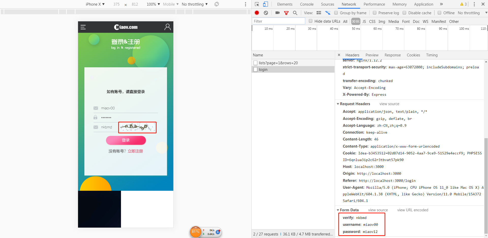
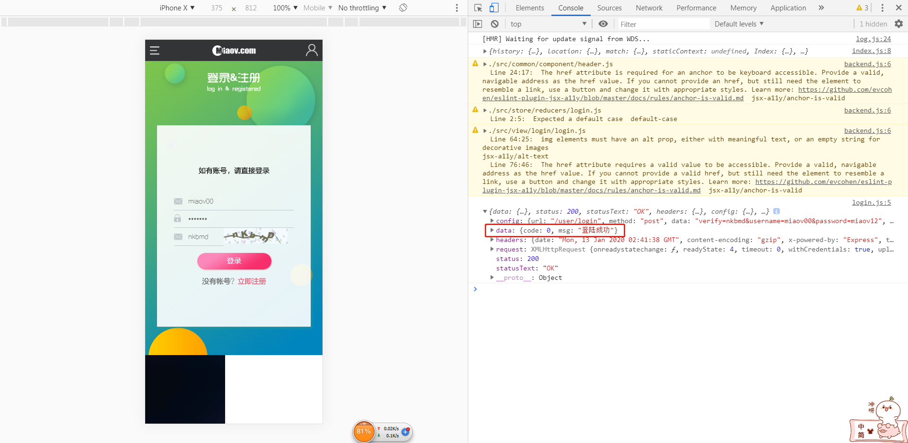
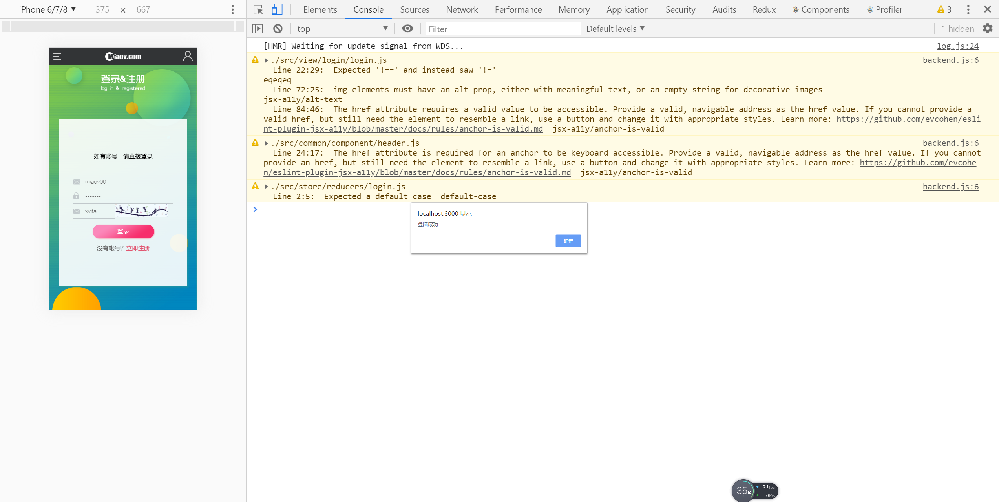

# 登录-2

> 练习
1. 接着上一节的做，我们先处理下点击验证码，切换验证码，具体做法如下
    ```js
    <p className="clearfix">
        <input 
            type="text"  
            placeholder="验证码" 
            value={vcode}
            onChange={(e) => {
                setVcode(e.target.value)
            }} 
            onFocus={e => {
                setVcodeShow(true) 
            }} 
            className="verifyCode"                      
        />
        {
            vcodeShow ? 
             {
                    setVcodeSrc("/miaov/user/verify?" + Date.now())
                }}
            />
            :
            ""
        }
    </p>    
    ```
2. 然后引入下我们的connect, 以及action中的login, 然后单独写一个登录的方法
    ```js
    function toLogin(){
        props.dispatch(login({
            verify: vcode, 
            username: user,
            password
        }))
    }  
    ``` 
3. 然后在点击登录按钮的时候调用这个方法 
    ```js
    <button className="form_btn" onClick={toLogin}>登录</button>    
    ```   
4. 然后随便输入一点信息，点击登录看下打印结果

    

5. 这里给个正确的账号密码测试下(miaov00/miaov12)   

    

    

6. 接着改下action下的login.js，主要处理下登录成功的状态，并且在HTTP.post前面加return，这样可以在LoginBox组件里拿到对应的数据
    ```js
    import HTTP from './http'
    export default function login(data){
        return function(dispatch){
            return HTTP.post("/user/login", data).then(res => {
                if(res.data.code === 0){
                    dispatch({
                        type: "LOGIN",
                        user: data.username
                    })
                }
                return res.data;
            })
        }
    }    
    ```
7. 最后就是去完善下我们的toLogin函数
    ```js
    function toLogin(){
        props.dispatch(login({
            verify: vcode, 
            username: user,
            password
        })).then(res => {
            alert(res.msg);
            setTimeout(() => {
                if(res.code != 0){
                    //登录失败
                    setVcodeSrc("/miaov/user/verify?" + Date.now())
                }
            }, 100)
        })
    }    
    ```   

8. 本节内容就这些，做完以后可以玩下
    * 随便输入，登录失败的弹窗，如下图

        失败弹窗.jpg)

    * 输入正确的验证码，之后随便输入，登录失败的弹窗，如下图

        

    * 输入正确的账号密码，输入正确的验证码，登录成功，如下图

        

 
           

> 目录

* [返回目录](../../README.md)
* [上一节-登录-1](../day-23/登录-1.md)
* [下一节-'返回上一页'功能](../day-25/返回上一页.md)