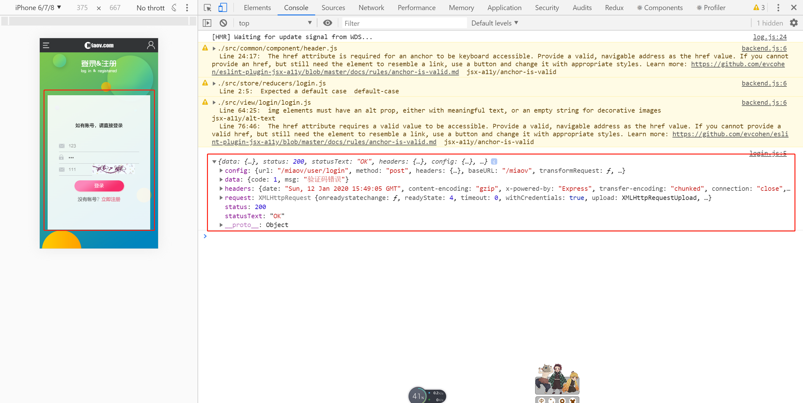

# 登录-2

> 练习
1. 接着上一节的做，我们先处理下点击验证码，切换验证码，具体做法如下
    ```js
    <p className="clearfix">
        <input 
            type="text"  
            placeholder="验证码" 
            value={vcode}
            onChange={(e) => {
                setVcode(e.target.value)
            }} 
            onFocus={e => {
                setVcodeShow(true) 
            }} 
            className="verifyCode"                      
        />
        {
            vcodeShow ? 
             {
                    setVcodeSrc("/miaov/user/verify?" + Date.now())
                }}
            />
            :
            ""
        }
    </p>    
    ```
2. 然后引入下我们的connect, 以及action中的login, 然后单独写一个登录的方法
    ```js
    function toLogin(){
        props.dispatch(login({
            verify: vcode, 
            username: user,
            password
        }))
    }  
    ``` 
3. 然后在点击登录按钮的时候调用这个方法 
    ```js
    <button className="form_btn" onClick={toLogin}>登录</button>    
    ```   
4. 然后随便输入一点信息，点击登录看下打印结果

    

 
           

> 目录

* [返回目录](../../README.md)
* [上一节-登录-1](../day-23/登录-1.md)