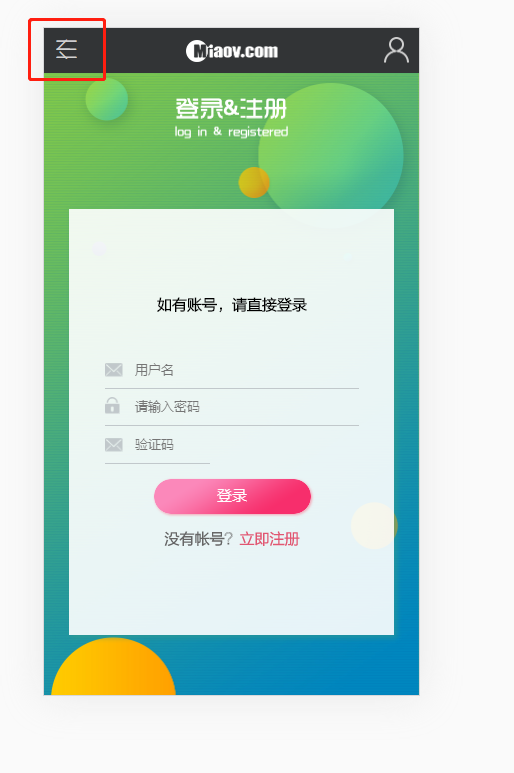
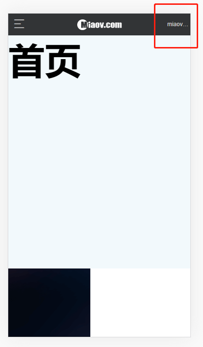

# header状态修改

> 实现的功能主要是

* 未登陆时，在首页，左上角应该是菜单的入口，右上角是登陆的入口
* 点击右上角登陆的入口跳转登录页面，此时左上角应该变为返回上一页，右上角登陆入口应该消失
* 登陆成功后，左上角依然是菜单的入口，取代右上角登录入口的应该是登陆者的username，代表已经登录了

> 练习
1. 先到frame文件夹中，修改header页面结构
    ```js
    import React from 'react'

    import {Link} from 'react-router-dom'

    export default function Header(){
        return (
            <header id="header">
                <nav className="menu">
                    {/* 返回按钮 */}
                    <a className="header-btn-left iconfont icon-back"></a>
                    {/* 菜单按钮 */}
                    <a className="header-btn-left iconfont icon-hycaidan"></a>
                </nav>
                <h1 className="logo">miaov.com</h1>
                <Link className="user" to="/login"/>
            </header>
        )
    }    
    ```
2. 简单修改下样式
    ```css
    .menu {
        position: absolute;
        width: 1.2rem;
        height: 1.2rem;
        left: 0;
        top: 0;
    }

    .header-btn-left, .header-btn-right{
        position: absolute;
        top: 0;
        width: 1.2rem;
        height: 1.2rem;
        text-align: center;
        color: #d1d1d1;
        line-height: 1.2rem;
        font-size: .7rem;
    }
    .header-btn-left{
        left: 0;
    }
    .header-btn-right{
        right: 0;
    }
    .header-user{
        padding-right: .1rem;
        text-align: right;
        overflow: hidden;
        font-size: .26rem;
        text-overflow: ellipsis;
    }

    /* .menu a {
        text-indent: -999px;
        overflow: hidden;
        display: block;
        width: 100%;
        height: 100%;
        background: url("../images/icon_menu.png") no-repeat;
        background-size: 100% 100%;
    } */    
    ``` 
3. 此时能看到效果就是这样的

    

4. 接下来来完成下菜单按钮和返回上一页按钮的功能  
    1. 需要withRouter
    2. 根据路由做判断，如果是/login页面则返回上一页的按钮，否则就是菜单的按钮
    3. 返回上一页使用我们之前自定义的hook
    4. 给返回按钮添加点击事件
    5. 具体代码如下
        ```js
        import React from 'react'

        import {Link, withRouter} from 'react-router-dom'

        import {useBack} from '../hook/index'

        function Header(props){
            const back = useBack(props.history);
            const path = props.location.pathname;
            return (
                <header id="header">
                    <nav className="menu">
                        {path === "/login" ?
                            // 返回按钮
                            <a className="header-btn-left iconfont icon-back"
                                onClick={() => {
                                    back();
                                }}
                            ></a>
                            :
                            // 菜单按钮
                            <a className="header-btn-left iconfont icon-hycaidan"></a>
                        }
                    </nav>
                    <h1 className="logo">miaov.com</h1>
                    <Link className="user" to="/login"/>
                </header>
            )
        }

        export default withRouter(Header);        
        ```

5. 再来处理右上角跳转登录页面的按钮
    1. 在登录页面的时候应该就没有这个按钮了
    2. 如果在首页应该显示这个按钮
    3. 我们单独封装一个方法，同样也是根据路由判断
        ```js
        function getUser(path){
            return path === "/login" ? "" : <Link className="user" to="/login"/>;
        }        
        ```
    4. 然后在原先Link标签的地方调用改下我们这个方法即可

6. 接下去来处理下登录的问题，登录成功后右上角应该显示用户名
    1. 首先肯定要用connect 
        ```js
        export default connect(state => {
            console.log(state);
            return {
                user: state.getUser
            }
        })(withRouter(Header));        
        ```       
    2. 这样我们就可以在props拿到user了，可以进行解构`const {user} = props;`  
    3. 接着我们来扩展下我们的getUser方法，传入第二个参数user
        ```js
        function getUser(path, user){
            if(path === "/login"){
                return ""
            }
            if(user){
                return <span className="header-btn-right header-user">{user}</span>
            }
            return <Link className="user" to="/login"/>
        }        
        ```
    4. 然后我们输入正确的账号密码(miaov00/miaov12)及验证码登录成功后就能看到

          

7. header.js完整的代码如下
    ```js
    import React from 'react'

    import {Link, withRouter} from 'react-router-dom'

    import {connect} from 'react-redux'

    import {useBack} from '../hook/index'


    function getUser(path, user){
        if(path === "/login"){
            return ""
        }
        if(user){
            return <span className="header-btn-right header-user">{user}</span>
        }
        return <Link className="user" to="/login"/>
    }

    function Header(props){
        // console.log(props);
        const back = useBack(props.history);
        const path = props.location.pathname;
        const {user} = props;
        return (
            <header id="header">
                <nav className="menu">
                    {path === "/login" ?
                        // 返回按钮
                        <a className="header-btn-left iconfont icon-back"
                            onClick={() => {
                                back();
                            }}
                        ></a>
                        :
                        // 菜单按钮
                        <a className="header-btn-left iconfont icon-hycaidan"></a>
                    }
                </nav>
                <h1 className="logo">miaov.com</h1>
                {getUser(path, user)}
            </header>
        )
    }

    export default connect(state => {
        // console.log(state);
        return {
            user: state.getUser
        }
    })(withRouter(Header));    
    ```             

> 目录

* [返回目录](../../README.md)
* [上一节-"返回上一页"功能](../day-25/返回上一页.md)