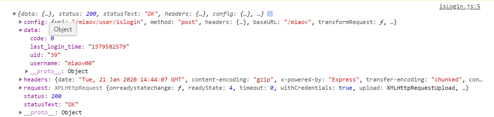
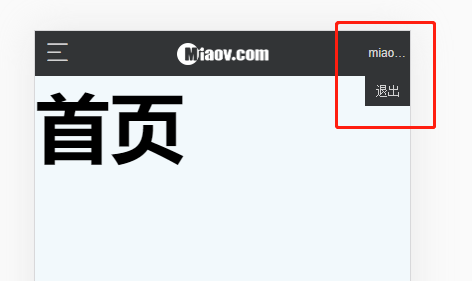

# 退出登录

> 练习
1. 上一节我们已经简单完成了登录功能，也操作了下，能成功登录，右上角也显示了我们的用户名
2. 但此时如果我们重新刷新页面又要重新登录，用户体验就很差，所以这边我们要做下处理
3. 先来看下接口，我们有一个/user/islogin的接口，来判断是否登录，所以在action的文件下新写个isLogin的
    ```js
    import HTTP from './http'
    export default function isLogin(){
        return function(dispatch){
            return HTTP.post("/user/islogin").then(res => {
                console.log(res)
            })
        }
    }    
    ```
4. 然后在header中使用useEffect，在页面一进去的时候调用下这个接口  
    ```js
    useEffect(() => {
        props.dispatch(isLogin())
    }, [])    
    ```
5. 然后我们打开控制台看下有没有结果，根据接口的数据，0是代表已经登录，1代表未登录，我们发现是已经登录的  

    

6. 接下来我们完善下我们的isLogin这个action
    ```js
    import HTTP from './http'
    export default function isLogin(){
        return function(dispatch){
            return HTTP.post("/user/islogin").then(res => {
                if(res.data.code === 0){
                    //已经登录
                    dispatch({
                        type: "LOGIN",
                        user: res.data.username
                    })
                }
            })
        }
    }    
    ``` 
7. 这样就解决了我们一开始的那个问题，刷新后不用再重新登录了~
8. 接着来看下登出功能，先来做个简单的布局
    ```js
    function getUser(path, user){
        if(path === "/login"){
            return ""
        }
        if(user){
            return (
                <span className="header-btn-right">
                    <span className="header-user">{user}</span>
                    <span className="header-logout-btn">退出</span>
                </span> 
            )
        }
        return <Link className="user" to="/login"/>
    }    
    ```
    ```css
    .header-user{
        display: block;
        padding-right: .1rem;
        text-align: right;
        overflow: hidden;
        font-size: .26rem;
        text-overflow: ellipsis;
    }
    .header-logout-btn{
        position: absolute;
        right: 0;
        width: 100%;
        top: 1.2rem;
        text-align: center;
        font: .3rem/.8rem '宋体';
        background-color: #323436;
    }    
    ```   
    
      

9. 我们有个退出登录的接口`/user/logout`，所以接着在action里添加logout.js
    ```js
    import HTTP from './http'
    export default function logout(){
        return function(dispatch){
            return HTTP.post("/user/logout").then(res => {
                if(res.data.code === 0){
                    dispatch({
                        type: "LOGOUT"
                    })
                }
            })
        }
    }       
    ```  
10. 先来做点击事件处理下 
    ```js
    function getUser(path, user, dispatch){
        if(path === "/login"){
            return ""
        }
        if(user){
            return (
                <span className="header-btn-right">
                    <span className="header-user">{user}</span>
                    <span className="header-logout-btn" onClick={() => {
                        dispatch(logout())
                    }}>退出</span>
                </span> 
            )
        }
        return <Link className="user" to="/login"/>
    }    
    ```
11. 然后测试下登出，发现没有任何问题。最后我们来处理登出的显示和隐藏，这边可以在重构下代码，最终代码如下
    ```js
    import React, {useEffect, useState} from 'react'

    import {Link, withRouter} from 'react-router-dom'

    import {connect} from 'react-redux'

    import {useBack} from '../hook/index'

    import isLogin from '../../store/action/isLogin'
    import logout from '../../store/action/logout'

    function Header(props){
        // console.log(props);
        const back = useBack(props.history);
        const [btnShow, setBtnShow] = useState(false);
        const path = props.location.pathname;
        const {user} = props;
        useEffect(() => {
            props.dispatch(isLogin())
        }, [])
        function getUser(){
            if(path === "/login"){
                return ""
            }
            if(user){
                return (
                    <span className="header-btn-right">
                        <span 
                            className="header-user"
                            onClick={()=>{
                                setBtnShow(!btnShow);
                            }}
                        >{user}</span>
                        <span 
                            className="header-logout-btn" 
                            onClick={() => {
                                props.dispatch(logout());
                            }}
                            style={{display: btnShow ? "block" : "none"}}
                        >退出</span>
                    </span> 
                )
            }
            return <Link className="user" to="/login"/>
        }
        return (
            <header id="header">
                <nav className="menu">
                    {path === "/login" ?
                        // 返回按钮
                        <a className="header-btn-left iconfont icon-back"
                            onClick={() => {
                                back();
                            }}
                        ></a>
                        :
                        // 菜单按钮
                        <a className="header-btn-left iconfont icon-hycaidan"></a>
                    }
                </nav>
                <h1 className="logo">miaov.com</h1>
                {getUser()}
            </header>
        )
    }

    export default connect(state => {
        // console.log(state);
        return {
            user: state.getUser
        }
    })(withRouter(Header));    
    ```           

> 目录

* [返回目录](../../README.md)
* [上一节-header状态修改](../day-26/header状态修改.md)
* [下一节-菜单展示](../day-28/菜单展开.md)