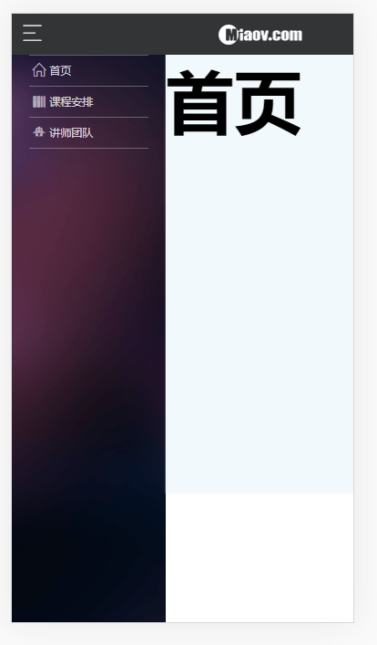

# 菜单展开

> 练习

* 之前为项目搭好了框架，在common的component目录下，找到frame.js，然后解构useState
* 使用hook，showMenu就是用来控制菜单展示的，默认为false，`const [showMenu, setShowMenu] = useState(false);`
* 进入common.css中给#main设置样式`transition: .5s;`
* 接着我们先写个样式看下效果，在frame.js中给main加上样式`<div id="main" style={{transform: "translateX(4.5rem)"}}>`

    

* 封装个changeShow方法，然后传给Header，记得在Header中解构 
    ```js
    function changeShow () {
        setShowMenu(!showMenu);
    }    
    ```
* 在菜单按钮这里添加点击事件，调用上述方法，并且这边还要修改下main的样式`style={{transform: `translateX(${showMenu ? 4.5 : 0}rem)`}}`
* 此时点击页面就能看到菜单展开的效果了
* 优化
    * user-scalable=no - 双击缩放，这个如何改掉，找到我们public下的index.html，给meta增加`<meta name="viewport" content="width=device-width, initial-scale=1, user-scalable=no"/>`，这样就不会有缩放了
    * 给main增加个方法，点击以后菜单缩回去~
        ```js
        function menuHide (){
            setShowMenu(false);
        }        
        ```
    * 最后给main添加onTouchStart方法，调用该方法即可 


> 目录

* [返回目录](../../README.md)
* [上一节-退出登录](../day-27/退出登录.md)