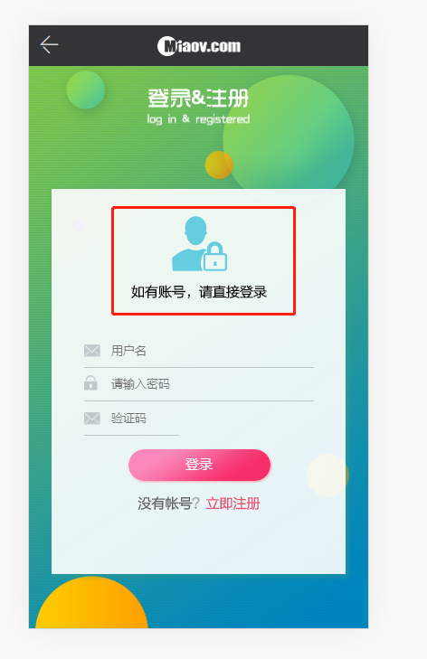
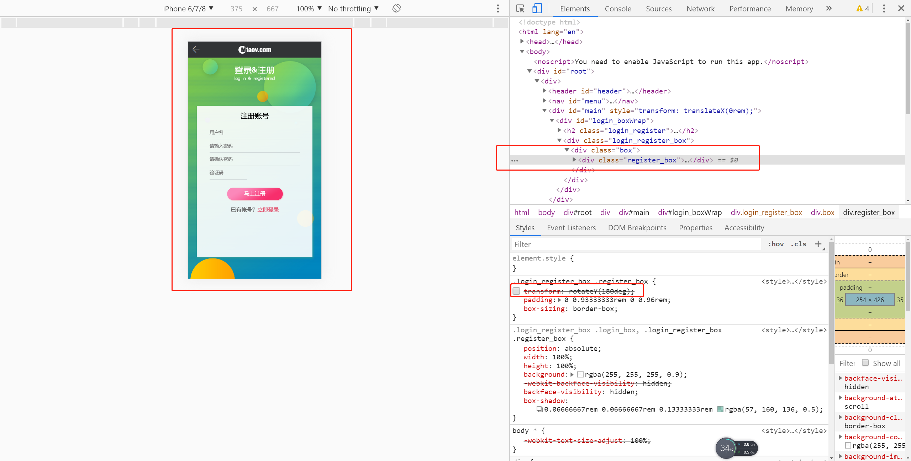
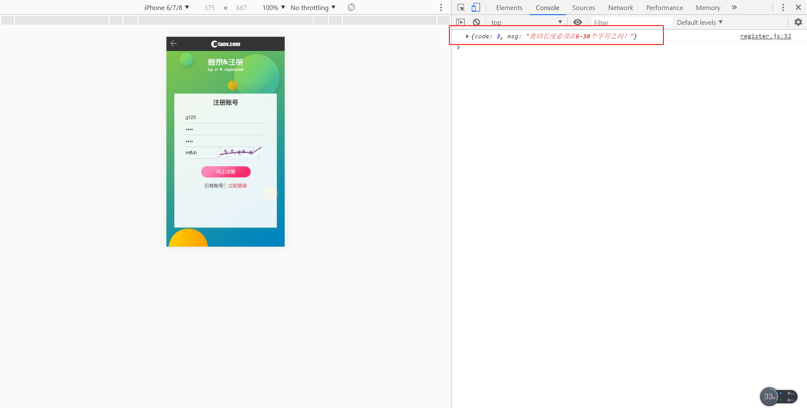

# 注册

> 练习

* 修复之前的一个bug，登录页面有张图片没有显示，react显示图片需要用到require函数
    * 具体代码为``
    * 页面效果如下

        

* 接着就是搞注册页面了，新建register.js，处理下页面结构以及些方法命名   
* 在index.js中import注册的组件
    ```js
    import React from 'react'

    import '../../common/css/login.css'

    import LoginBox from './login'

    import RegisterBox from './register'

    export default function Login(){
        return (
            <div id="login_boxWrap">
                <h2 className="login_register"><span>登录&注册</span></h2>
                <div className="login_register_box">
                    <div className="box">
                        <LoginBox/>
                        <RegisterBox/>
                    </div>
                </div>
            </div>
        )
    }    
    ``` 
* 此时我们可以控制台调试，在elements调试的地方把login_box删了，然后在把注册的旋转的样式去掉就可以看到我们的注册页面 

    

* 注册登录页面跳转功能
    * 在index中解构useState，用来控制角度`const [deg, setDeg] = useState(0);`
    * 给box添加样式`<div className="box" style={{transform: `rotateY(${deg}deg)`}}>`
    * 把setDeg方法传入2个子组件中
    * 2个子组件需要解构该方法，并且在跳转的时候调用该方法，登录的组件角度传180，注册的组件传0 
    * 这里简单贴下login组件的跳转`<a href="#" onClick={()=>{setDeg(180)}}>立即注册</a>`   

* 接着来处理下注册
    * 新建个register.js，初始代码如下
        ```js
        import HTTP from './http'
        export default function register(data){
            return function(dispatch){
                return HTTP.post("/user/register", data).then(res => {
                    if(res.data.code === 0){
                        
                    }
                    return res.data;
                })
            }
        }    
        ```
    * 接着去我们的注册组件里import，对应修改下方法 
        ```js
        function toRegister(){
            //一开始可以做验证这边我就偷懒不写了
            props.dispatch(register({
                verify: vcode, 
                username: user,
                password,
                repassword: password2
            })).then(res => {
                console.log(res); //看下控制台信息
            })
        }        
        ``` 
    * 此时我们比如账号密码确认密码全输入`g123`点击注册看下效果

         

    * 注册成功我们可以这么处理 
        ```js
        function toRegister(){
            //一开始可以做验证这边我就偷懒不写了
            props.dispatch(register({
                verify: vcode, 
                username: user,
                password,
                repassword: password2
            })).then(res => {
                // console.log(res); //看下控制台信息
                alert(res.msg)
                setTimeout(() => {
                    if(res.code == 0){
                        setDeg(0); //注册成功翻转回登录页面
                    }
                    setVcodeSrc("/miaov/user/verify?" + Date.now())
                }, 100)
            })
        }        
        ```        

> 目录

* [返回目录](../../README.md)
* [上一节-退出登录](../day-28/菜单展开.md)