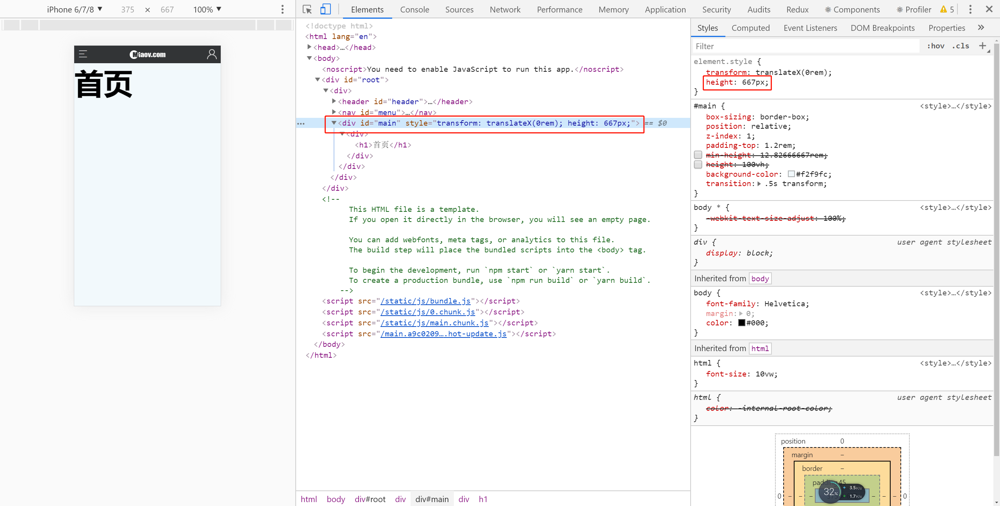
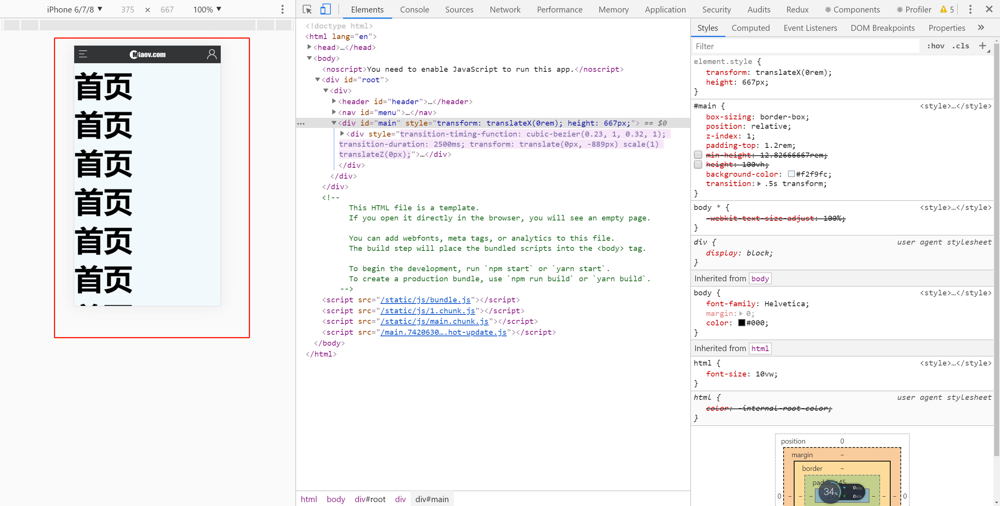

# 滑屏处理

> 练习

* 使用better-scroll，所以在frame.js里import下`import BScroll from 'better-scroll';`
* 滑屏操作先修改下样式，方便调试，还是在#main处理
    ```css
    #main {
        box-sizing: border-box;
        position: relative;
        z-index: 1;
        padding-top: 1.2rem;
        /* min-height: 12.82666667rem; */ 
        /* height: 100vh; */
        background-color: #f2f9fc;
        transition: .5s transform;
    }    
    ```
* 获取屏幕高度，是个通用逻辑，所以我们单独写个hook 
    ```js
    function useBack(history){
        return () => {
            if(history.length > 1){
                history.goBack();
            }else{
                history.push("/")
            }
        }
    }

    function useInnerHeight(){
        return window.innerHeight;
    }

    export {
        useBack,
        useInnerHeight,
    };    
    ```
* 在frame中引入这个hook，`import {useInnerHeight} from '../hook/index'`    
* 给div#main设置style
    ```html
    <div 
        id="main" 
        style={{transform: `translateX(${showMenu ? 4.5 : 0}rem)`, height: innerH}}
        onTouchStart={() => {
            menuHide();
        }}
    ></div>    
    ```
* 能在页面上看到设置的样式  

    

* 把滑屏的元素处理下
    ```html
    <div className="pageWrap">
        <div>
            {props.children}
        </div>
    </div>    
    ```    
* 使用生命周期useEffect，这里我们只需要执行一次，所以后面需要传入个空数组 
* better-scroll需要配置元素，所以我们这里还要使用useRef的hook，具体代码如下，不要忘记在div#main元素上要写`ref={wrap}`
    ```js
    const wrap = useRef(null);
    let pageScroll = null;  
    useEffect(() => {
        pageScroll = new BScroll(wrap.current);
    }, [])  
    ```
* 为了演示滑屏，我们可以在首页的页面中多写点内容，比如写很多h1首页

    

* 设置下pageWrap的样式，前面是为了测试把ref加在了div#main，其实并不是本意，删除前面的ref，加在pageWrap上  
    ```css
    .pageWrap {
        position: relative;
        height: 100%;
        overflow: hidden;
    }    
    ```

> 目录

* [返回目录](../../README.md)
* [上一节-注册](../day-29/注册.md)
* [下一节-menu完善](../../Day31-45/day-31/menu完善.md)