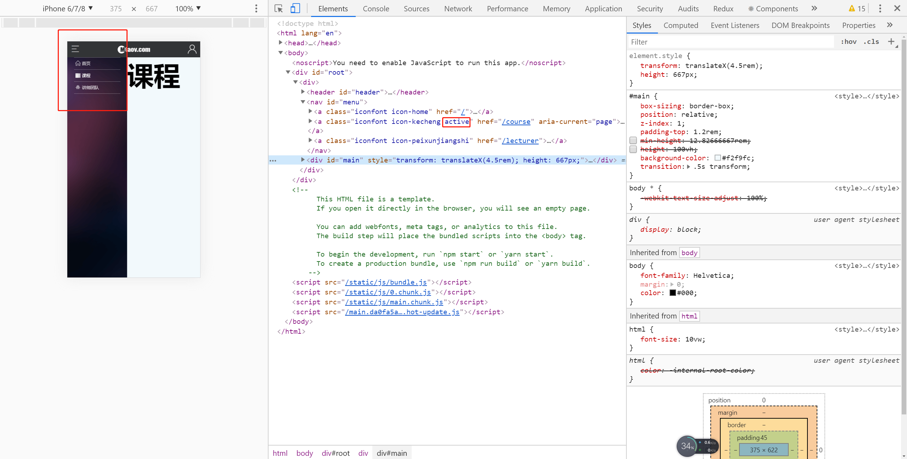

# menu完善

> 练习

* 菜单这里现在用的都是a标签所以需要改写成NavLink，找到menu.js
* 改完后，跳转页面就没什么问题了，但点击菜单后希望menu隐藏，所以回到frame.js，把隐藏菜单的方法传入Menu组件
* 在NavLink点击后调用该方法就完成以上功能、
* 优化
    * 我们可以把导航写在route_list.js，新增个数组nav
        ```js
        import React from 'react'

        import Index from '../view/index/index'
        import Course from '../view/course/index'
        import Lectruer from '../view/lecturer/index'
        import Login from '../view/login/index'
        import Work from '../view/work/index'

        const routeList = [
            {
                name: "首页",
                path: "/",
                exact: true,
                render(props){
                    return <Index {...props}/>
                }
            },
            {
                name: "课程",
                path: "/course",
                exact: true,
                render(props){
                    return <Course {...props}/>
                }
            },
            {
                name: "讲师团队",
                path: "/lecturer",
                exact: true,
                render(props){
                    return <Lectruer {...props}/>
                }
            },
            {
                name: "登录注册",
                path: "/login",
                exact: true,
                render(props){
                    return <Login {...props}/>
                }
            },
            {
                name: "作品",
                path: "/work",
                exact: true,
                render(props){
                    return <Work {...props}/>
                }
            },
        ];

        const nav = [
            {
                name: "首页",
                path: "/",
                exact: true,
                className: 'iconfont icon-home'
            },
            {
                name: "课程",
                path: "/course",
                exact: true,
                className: 'iconfont icon-kecheng'
            },
            {
                name: "讲师团队",
                path: "/lecturer",
                exact: true,
                className: 'iconfont icon-peixunjiangshi'
            },
        ]

        export {routeList, nav};        
        ```
    * 在menu.js中引入，使用map渲染
    * 使用onTouchEnd方法，不要使用onClick 
    * 添加activeClassName，并且不要忘记添加exact 
    * 添加active的样式
        ```css
        #menu a.active {
            color: #fff;
        }

        #menu a.active:before {
            color: #fff;
        }        
        ```

        

> 目录

* [返回目录](../../README.md)
* [上一节-menu完善](../../Day16-30/day-30/滑屏处理.md)