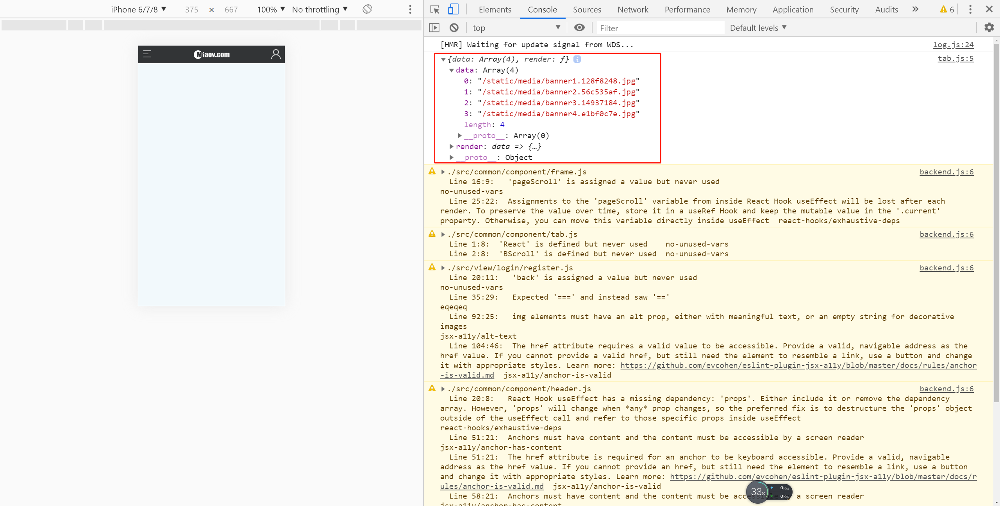
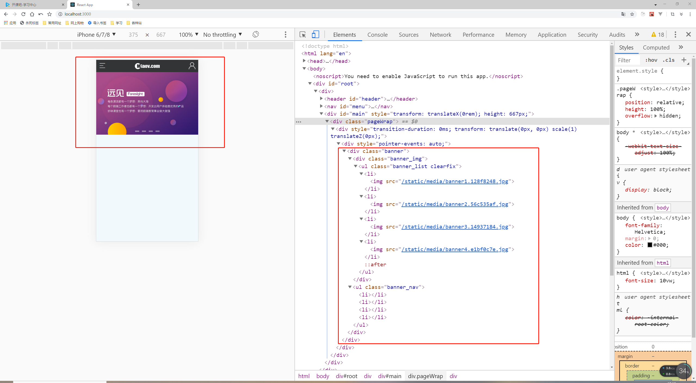

# 通用幻灯片组件-1

> 练习

* 创建通用组件tab
    * 在component下新建tab.js
    * 先简单的写下
        ```js
        import React from 'react';
        import BScroll from 'better-scroll';

        export default function Tab(){
            return (
                ""
            )
        }        
        ```
    * 找到首页视图index.js，import这个幻灯片组件，同时声明定义首页幻灯片的数组，给Tab组件传值  
        ```js
        import React from 'react'

        import {connect} from 'react-redux'

        import Tab from '../../common/component/tab'

        import '../../common/css/index.css'

        let imgData = [
            require("../../common/images/banner1.jpg"),
            require("../../common/images/banner2.jpg"),
            require("../../common/images/banner3.jpg"),
            require("../../common/images/banner4.jpg"),
        ]

        function Index(props){
            // console.log(props)
            return (
                <div>
                    <Tab 
                        data={imgData}
                        render={(data) => {
                            return 
                        }}
                    />
                </div>
            )
        }

        export default connect(res => {
            return res;    
        })(Index);       
        ```  
    * 回到Tab组件，打印下props看下  

          

    * 接着给Tab组件html结构    
        ```js
        import React from 'react';
        import BScroll from 'better-scroll';

        export default function Tab(props){
            // console.log(props);
            let {data, render} = props;
            return (
                <div className="banner">
                    <div className="banner_img">
                        <ul className="banner_list clearfix">
                            {data.map((item, index) => <li key={index}>{render(item)}</li>)}
                        </ul>
                    </div> 
                    <ul className="banner_nav">
                        {data.map((item, index) => <li key={index}></li>)}
                    </ul>
                </div>
            )
        }       
        ```
    * 此时页面效果为    

        

> 目录

* [返回目录](../../README.md)
* [上一节-menu完善.md](../day-31/menu完善.md)
* [下一节-通用幻灯片组件-2.md](../day-33/通用幻灯片组件-2.md)