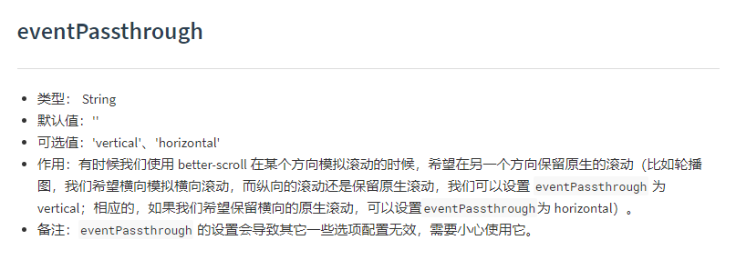
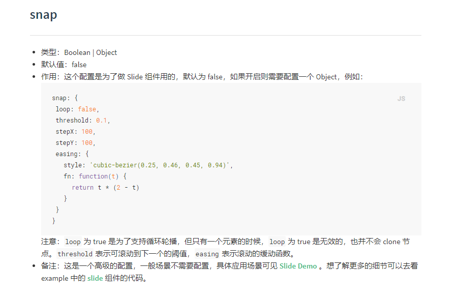
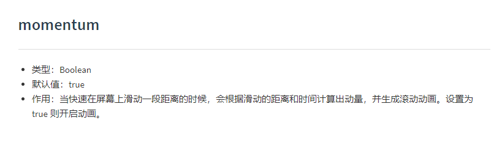
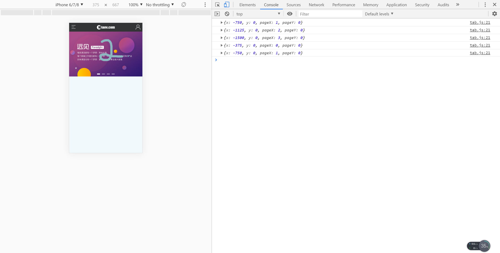

# 通用幻灯片组件-2

> 知识大纲

* [better-scroll文档](http://ustbhuangyi.github.io/better-scroll/doc/zh-hans/)

> 练习

* 使用better-scroll最简单的例子，如下
    ```js
    import React, {useEffect, useRef} from 'react';
    import BScroll from 'better-scroll';

    export default function Tab(props){
        // console.log(props);
        let {data, render} = props;
        let bScroll = null;
        let bannerWrap = useRef(null);
        useEffect(() => {
            bScroll = new BScroll(bannerWrap.current, {
                scrollX: true,
                scrollY: false,
            })
        }, [])
        return (
            <div className="banner">
                <div className="banner_img" ref={bannerWrap}>
                    <ul className="banner_list clearfix">
                        {data.map((item, index) => <li key={index}>{render(item)}</li>)}
                    </ul>
                </div> 
                <ul className="banner_nav">
                    {data.map((item, index) => <li key={index}></li>)}
                </ul>
            </div>
        )
    }    
    ```
* 接着我们使用些比较高端的配置
    * eventPassthrough - 让另外个方向保留原生滚动     

         

    * snap - 可配置循环，比如loop属性

          

    * momentum - 设置为false后每次滑屏只能滑一张，否则会根据快速滑屏多滑几张

            

* snap配置好loop后，发现样式有问题，需要更改index.css中.banner_list  
    ```css
    .banner_list {
        display: flex;
        float: left;
    }
    .banner_list li {
        width: 100vw;
        flex: none;
    }
    .banner_list img {
        width: 100%;
        overflow: hidden;
    }    
    ```   

* 现在在来处理下图片下面的tab小方块
    * 先使用useState来控制当前第几张，`const [now, setNow] = useState(0);` 
    * 给li设置样式，`className={index===now ? 'active' : ''}>` 
    * bScroll添加滚动结束事件
        ```js
        bScroll.on('scrollEnd', () => {
            console.log(bScroll.getCurrentPage());
        })        
        ```   

            

* 自动轮播实现
    * 开启定时器
    * 手指按下时停止定时器
    * 手指离开时再次开启定时器
    * 组件摧毁时也要关闭定时器，如切换到其他菜单

* 完整代码如下
    ```js
    import React, {useEffect, useRef, useState} from 'react';
    import BScroll from 'better-scroll';

    export default function Tab(props){
        // console.log(props);
        let {data, render} = props;
        let bScroll = null;
        let bannerWrap = useRef(null);
        const [now, setNow] = useState(0);
        useEffect(() => {
            let timer = 0;
            bScroll = new BScroll(bannerWrap.current, {
                scrollX: true,
                scrollY: false,
                eventPassthrough: 'vertical',
                momentum: false,
                snap: {
                    loop: true,
                }
            });
            bScroll.on('scrollEnd', () => {
                // console.log(bScroll.getCurrentPage());
                setNow(bScroll.getCurrentPage().pageX);
            })
            timer = setInterval(() => {
                bScroll.next(200);
            }, 2000)
            bannerWrap.current.addEventListener('touchstart', () => {
                clearInterval(timer);
            })
            bannerWrap.current.addEventListener('touchend', () => {
                timer = setInterval(() => {
                    bScroll.next(200);
                }, 2000)
            })
            return () => {
                //组件摧毁时也需要关闭定时器
                clearInterval(timer);
            }
        }, [])
        return (
            <div className="banner">
                <div className="banner_img" ref={bannerWrap}>
                    <ul className="banner_list clearfix">
                        {data.map((item, index) => <li key={index}>{render(item)}</li>)}
                    </ul>
                </div> 
                <ul className="banner_nav">
                    {data.map((item, index) => {
                        return (
                            <li 
                                key={index} 
                                className={index===now ? 'active' : ''}>    
                            </li>
                        )
                    })}
                </ul>
            </div>
        )
    }    
    ```    

> 目录

* [返回目录](../../README.md)
* [上一节-通用幻灯片组件-1](../day-32/通用幻灯片组件-1.md)
* [下一节-首页静态组件](../day-34/首页静态组件.md)