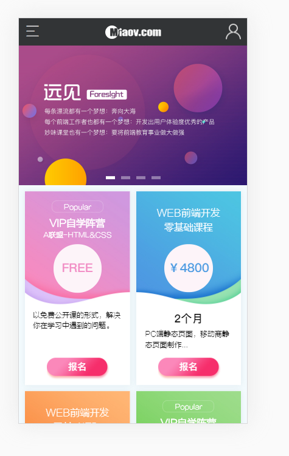

# 首页静态组件

> 练习

* 在首页组件中新增页面结构
    ```js
    function Index(props){
        // console.log(props)
        return (
            <div>
                <Tab 
                    data={imgData}
                    render={(data) => {
                        return 
                    }}
                />
                <section className="index_content"> 

                </section>
            </div>
        )
    }    
    ```

* 在首页文件夹中新建课程组件`course.js`，复制下静态文件的格式
    ```js
    import React from 'react'

    export default function Course(){
        return (
            <ul className="content_list clearfix">
                <li className="pop_li">
                    <button className="popular">Popular</button>
                    <h3 className="list_title">
                        VIP自学阵营
                        <span>A联盟-HTML&amp;CSS</span> 
                    </h3>
                    <p className="price">FREE</p>
                    <div className="txt">
                        <p>以免费公开课的形式，解决你在学习中遇到的问题。</p>
                        <button className="signUp">报名</button>
                    </div>
                </li>
                <li className="month_li">
                    <h3 className="list_title">WEB前端开发<br/>
                    零基础课程</h3>
                    <p className="price">￥4800</p>
                    <div className="txt">
                        <time>2个月</time>
                        <p>
                            PC端静态页面，移动商静
                            态页面制作...
                        </p>
                        <button className="signUp">报名</button>
                    </div>
                </li>
                <li className="month_li">
                    <h3 className="list_title">WEB前端开发<br/>
                        零基础课程</h3>
                    <p className="price">￥9200</p>
                    <div className="txt">
                        <time>4个月</time>
                        <p>
                            作用域、闭包、原型链、核
                            心算法...
                        </p>
                        <button className="signUp">报名</button>
                    </div>
                </li>
                <li className="pop_li">
                    <button className="popular">Popular</button>
                    <h3 className="list_title">
                        VIP自学阵营
                        <span>B联盟-JavaScript</span>
                    </h3>
                    <p className="price">FREE</p>
                    <div className="txt">
                        <p>以免费公开课的形式，解决
                        你在学习中遇到的问题。</p>
                        <button className="signUp">报名</button>
                    </div>
                </li>
            </ul>
        )
    }    
    ```
* 在首页组件中引用Course组件，看下页面效果   

    

* 接着，和上述步骤差不多，我们在新建个vip组件，miaov组件 

* better-scroll超链接失效的问题怎么解决？
    * better-scroll会阻止默认事件，所以超链接就失效了
    * 我们可以在给失效的a标签添加事件
    * 也可以使用better-scroll的配置项**preventDefaultException**
    * 我们进到frame.js中，给better-scroll这个配置项
        ```js
        useEffect(() => {
            pageScroll = new BScroll(wrap.current, {
                preventDefaultException: {
                    tagName: /^(INPUT|TEXTAREA|BUTTON|SELECT|A)$/
                }
            });
        }, [])        
        ```

> 目录

* [返回目录](../../README.md)
* [上一节-通用幻灯片组件-2](../day-33/通用幻灯片组件-2.md)