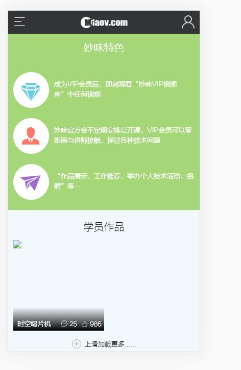

# 学员作品列表结构

> 练习
* 在common的components新建works.js组件，代表学员作品
* 复制响应的结构，留一个li
    ```js
    import React from 'react'

    export default function Works(){
        return (
            <div className="works">
                <h3>学员作品</h3>
                <ul className="works_list clearfix">
                    <li>
                        <a href="#">
                            
                            <span className="wrork_txt clearfix">
                                <strong>时空唱片机</strong>
                                <span>
                                    <em>25</em>
                                    <em>986</em>
                                </span>
                            </span>
                        </a>
                    </li>
                </ul>
                <a className="more" href="#">上滑加载更多......</a>
            </div>        
        )
    }    
    ```
* 在首页index.js中引入works  
    ```js
    import React from 'react'

    import {connect} from 'react-redux'

    import Tab from '../../common/component/tab'
    import Works from '../../common/component/works'
    import Course from './course'
    import Vip from './vip'
    import Miaov from './miaov'

    import '../../common/css/index.css'

    let imgData = [
        require("../../common/images/banner1.jpg"),
        require("../../common/images/banner2.jpg"),
        require("../../common/images/banner3.jpg"),
        require("../../common/images/banner4.jpg"),
    ]

    function Index(props){
        // console.log(props)
        return (
            <div>
                <Tab 
                    data={imgData}
                    render={(data) => {
                        return 
                    }}
                />
                <section className="index_content"> 
                    <Course />
                </section>
                <Vip />
                <Miaov />
                <Works />
            </div>
        )
    }

    export default connect(res => {
        return res;    
    })(Index);    
    ```
* 此时页面的效果是这样的  

    

> 目录

* [返回目录](../../README.md)
* [上一节-首页静态组件](../day-34/首页静态组件.md)
* [下一节-作品列表状态设置](../day-36/作品列表状态设置.md)