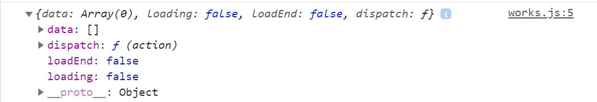

# 作品列表状态设置

> 练习

* 接着就是处理学生作品的数据了
* 在reducers新建works.js
    ```js
    export default function works(state={
        data: [],
        loading: false,
        loadEnd: false,
    }, action){
        switch(action.type){
            case "LOAD":
                return {
                    ...state,
                    loading: true
                };
            case "LOADOVER":
                return {
                    ...state,
                    loading: false,
                    data: action.data,
                }  
            case "LOADEND":
                return {
                    ...state,
                    loadEnd: true
                }      
        }
        return state;
    }    
    ```
* 在reducers中的index中import
    ```js
    import getUser from './login'
    import works from './works'

    export default {
        getUser,
        works,
    }    
    ``` 
* 在works组件中，引入`import {connect} from 'react-redux'`，完整的代码如下
    ```js
    import React from 'react'
    import {connect} from 'react-redux'

    function Works(props){
        console.log(props);
        return (
            <div className="works">
                <h3>学员作品</h3>
                <ul className="works_list clearfix">
                    <li>
                        <a href="#">
                            
                            <span className="wrork_txt clearfix">
                                <strong>时空唱片机时空唱片机时空唱片机时空唱片机</strong>
                                <span>
                                    <em>25</em>
                                    <em>986</em>
                                </span>
                            </span>
                        </a>
                    </li>
                </ul>
                <a className="more" href="#">上滑加载更多......</a>
            </div>        
        )
    }

    export default connect(state => state.works)(Works);    
    ```       

* 此时能看到打印的结果(works组件)

    

* 如何处理works的dispatch如何放到frame使用，且frame的滑屏处理，因为frame在App.js是整个应用的，实际是不合适的
    * 先把App中的frame注释掉
    * 可以谁用frame就把frame包在外面
    * 找到首页视图Index，在最外层包层frame，代码如下
        ```
        <Frame>
            <div>
                <Tab 
                    data={imgData}
                    render={(data) => {
                        return 
                    }}
                />
                <section className="index_content"> 
                    <Course />
                </section>
                <Vip />
                <Miaov />
                <Works />
            </div>
        </Frame>        
        ``` 
    * 所以之前的Works的组件就不需要在包装了

* 这里展示下首页index.js的完整代码
    ```js
    import React from 'react'

    import {connect} from 'react-redux'

    import Frame from '../../common/component/frame'
    import Tab from '../../common/component/tab'
    import Works from '../../common/component/works'
    import Course from './course'
    import Vip from './vip'
    import Miaov from './miaov'

    import '../../common/css/index.css'

    let imgData = [
        require("../../common/images/banner1.jpg"),
        require("../../common/images/banner2.jpg"),
        require("../../common/images/banner3.jpg"),
        require("../../common/images/banner4.jpg"),
    ]

    function Index(props){
        // console.log(props)
        return (
            <Frame>
                <div>
                    <Tab 
                        data={imgData}
                        render={(data) => {
                            return 
                        }}
                    />
                    <section className="index_content"> 
                        <Course />
                    </section>
                    <Vip />
                    <Miaov />
                    <Works />
                </div>
            </Frame>
        )
    }

    export default connect(props => {
        return {...props.works}; //为了返回个新对象，直接返回是引用类型需要注意下    
    })(Index);    
    ```           

> 目录

* [返回目录](../../README.md)
* [上一节-学员作品列表结构](../day-35/学员作品列表结构.md)