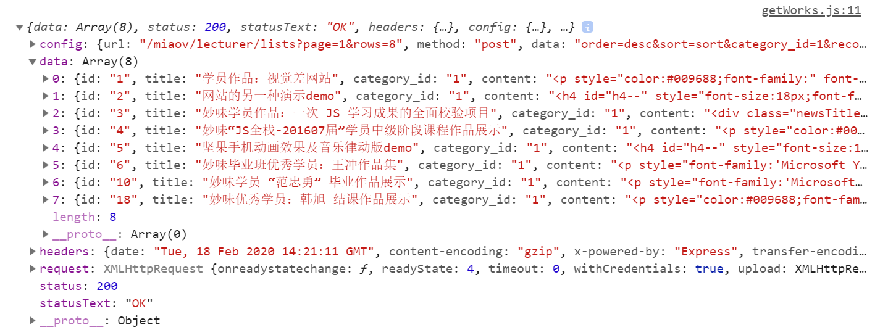

# 作品列表数据获取

> 练习

* 在action中新建getWorks.js
    ```js
    import HTTP from './http'
    export default function getWorks(page){
        return function(dispatch){
            return HTTP.post(`/lecturer/lists?page=${page}&rows=8`, {
                order: "desc",
                sort: "sort",
                category_id: 1,
                recommend: 1
            })
            .then(res => {
            console.log(res);
            })
        }
    }    
    ```
* 在首页中，写个获取作品的方法`getWorksData`，并且调用
    ```js
    import React, {useState, useEffect} from 'react'

    import {connect} from 'react-redux'

    import Frame from '../../common/component/frame'
    import Tab from '../../common/component/tab'
    import Works from '../../common/component/works'
    import Course from './course'
    import Vip from './vip'
    import Miaov from './miaov'

    import getWorks from '../../store/action/getWorks'

    import '../../common/css/index.css'

    let imgData = [
        require("../../common/images/banner1.jpg"),
        require("../../common/images/banner2.jpg"),
        require("../../common/images/banner3.jpg"),
        require("../../common/images/banner4.jpg"),
    ]

    function Index(props){
        const [page, setPage] = useState(1);
        let {dispatch} = props;
        function getWorksData(){
            dispatch(getWorks(page))
        }
        useEffect(() => {
            getWorksData();
        }, [])
        return (
            <Frame>
                <div>
                    <Tab 
                        data={imgData}
                        render={(data) => {
                            return 
                        }}
                    />
                    <section className="index_content"> 
                        <Course />
                    </section>
                    <Vip />
                    <Miaov />
                    <Works />
                </div>
            </Frame>
        )
    }

    export default connect(props => {
        return {...props.works};    
    })(Index);    
    ``` 

* 然后看下页面打印的结果    

    

* 接着处理下getWorks中的dispatch，reducers中的works及打印下index中的props 
    ```js
    import HTTP from './http'
    export default function getWorks(page){
        return function(dispatch){
            dispatch({
                type: "LOAD"
            })
            return HTTP.post(`/lecturer/lists?page=${page}&rows=8`, {
                order: "desc",
                sort: "sort",
                category_id: 1,
                recommend: 1
            })
            .then(res => {
            //    console.log(res);
            dispatch({
                type: "LOADOVER",
                data: res.data
            })
            })
        }
    }    
    ```  
    ```js
    export default function works(state={
        data: [],
        loading: false,
        loadEnd: false,
    }, action){
        switch(action.type){
            case "LOAD":
                return {
                    ...state,
                    loading: true
                };
            case "LOADOVER":
                return {
                    ...state,
                    loading: false,
                    data: state.data.concat(action.data), //这里拼接下数据
                }  
            case "LOADEND":
                return {
                    ...state,
                    loadEnd: true
                }      
        }
        return state;
    }    
    ```

* 接着就可以把数据传到我们的Works组件`<Works {...props}/>`    
* Works组件
    * 处理拿到的数据并渲染
        ```js
        import React from 'react'

        function Works(props){
            let {data, loadEnd, loading} = props;
            return (
                <div className="works">
                    <h3>学员作品</h3>
                    <ul className="works_list clearfix">
                        {data.map(item => (
                            <li key={item.id}>
                                <a href="#">
                                    
                                    <span className="wrork_txt clearfix">
                                    <strong>{item.title}</strong>
                                        <span>
                                            <em>{item.message}</em>
                                            <em>{item.good}</em>
                                        </span>
                                    </span>
                                </a>
                            </li>
                        ))}
                    </ul>
                    <a className="more" href="#">上滑加载更多......</a>
                </div>        
            )
        }

        export default Works;        
        ```
    * 页面上就能看到渲染的内容 

          

    * 处理状态(上滑加载更多，正在加载中，没有新的数据了)  
        * 具体代码如下
            ```
            <a className="more" href="#">{loadEnd ? "没有新的数据了" : (loading ? "正在加载中..." : "上滑加载更多")}</a>            
            ```   


> 目录

* [返回目录](../../README.md)
* [上一节-作品列表状态设置](../day-36/作品列表状态设置.md)